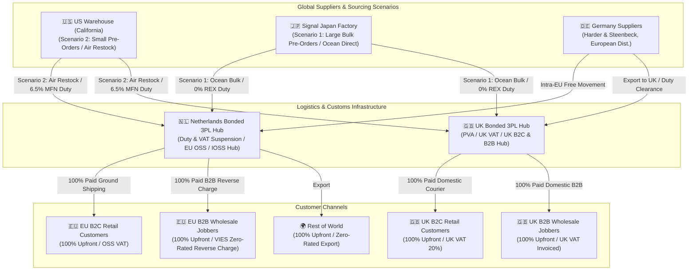

# Coast Airbrush Europe: Executive Master Strategy, Tax & Duty Optimization & Financial Architecture Playbook

> [!IMPORTANT]
> **Executive Summary & Strategic Mandate**  
> Coast Airbrush Europe represents the European expansion of the world's premiere custom automotive, fine art, and airbrushing supply brand. Operating across post-Brexit regulatory borders requires an elite, tax-optimized supply chain and financial architecture. This playbook establishes a tax-minimized, duty-efficient, high-margin roadmap for serving B2C retail artists and B2B wholesale jobbers across the United Kingdom, the 27 EU Member States, and international markets.
>
> **FOUNDER CASH POLICY MANDATE**: All sales across both B2C retail and B2B wholesale jobber/dealer channels operate under a strict **100% Upfront Payment Prior to Shipment** policy. Zero 30/60-day credit terms are extended. This guarantees a hyper-positive working capital cycle and complete elimination of bad debt / accounts receivable credit risk.

---

## Strategic Overview & Global Operating Ecosystem



---

## Section 1: International Supply Chain & Fulfillment Logistics Architecture

### 1.1 Founder Sourcing Scenarios Analysis

Coast Airbrush Europe utilizes a strategic **Dual-Sourcing Fulfillment Architecture**:

1. **Scenario 1: Large Bulk Pre-Orders (Primary Supply Chain - Direct Japan Ocean)**:
   - **Physical Goods**: Shipped directly from Signal Japan's manufacturing facility to Netherlands (Rotterdam) / UK (Felixstowe) 3PL hubs via bulk ocean cargo.
   - **Commercial Invoicing**: Invoiced by Coast USA (US corporate IP holder).
   - **Customs Tariff & Duty**: Physical origin is **Japan**. Qualifies for **0.0% Preferential Duty** under EU-Japan EPA / UK-Japan CEPA via Signal Japan's Registered Exporter (REX) origin declaration on commercial shipping documents.
   - **Financial Result**: Lowest freight cost per unit (€3.00), zero customs duty, delivering maximum gross margin (**68.99% on paints, 58.94% on hardware**).

2. **Scenario 2: Small Pre-Orders & Rapid Restock (Backup Supply Chain - US Air)**:
   - **Physical Goods & Invoice**: Shipped directly from Coast USA's California warehouse via air cargo / fast LCL.
   - **Customs Tariff & Duty**: Origin/shipping is **United States**. Subject to standard MFN tariffs (**6.5% for paints under HS 3208/3209, 1.7% for hardware under HS 8424.20**).
   - **Financial Result**: Higher freight cost (€14.00/unit) and IATA Hazmat air surcharges (€8.00/unit), providing a rapid stockout buffer while maintaining healthy **50.65% to 55.90% gross margins**.

---

### 1.2 Fulfillment Strategy Options Analysis

Evaluating four candidate distribution models for Coast Airbrush Europe:

| Metric / Dimension | Option A: Single UK Warehouse Hub | Option B: Single EU Warehouse Hub (NL/DE) | Option C: Dual-Hub Structure (UK + NL) | Option D: Direct Dropshipping from US/JP |
| :--- | :--- | :--- | :--- | :--- |
| **UK Market Speed & Delivery Cost** | ⚡ High (Next-Day, £4-£8) | 🐢 Moderate (2-4 Days, £12-£18 + Customs) | ⚡ High (Next-Day, £4-£8) | 🐢 Slow (5-10 Days, High Air Courier) |
| **EU 27 Market Speed & Delivery Cost** | 🐢 Slow (3-7 Days, Double Clearance) | ⚡ High (1-3 Days, Low Intra-EU Rates) | ⚡ High (1-3 Days, Low Rates) | 🐢 Slow (7-14 Days, Customs Delays) |
| **Post-Brexit Double Duty Risk** | ❌ **High Risk** (Goods cleared into UK pay UK duty, then pay EU duty upon shipping to EU) | 🟢 Zero for EU; Duty on UK imports | 🟢 Zero Double Duty (Imports cleared at destination hub) | 🟢 Zero Double Duty |
| **Dangerous Goods (ADR/IATA) Compliance** | 🟡 UK Domestic ADR straightforward; Cross-border parcel restrictions high | 🟢 Intra-EU ADR road transport seamless & cost-effective | 🟢 Optimized local ADR compliance in both zones | ❌ **Severe Overhead** (IATA Air Cargo surcharges £80-£150/pkg) |
| **VAT & Administrative Complexity** | 🟡 UK VAT simple; EU IOSS/OSS registration required | 🟢 EU OSS simple; UK VAT registration required | 🟡 Dual entity / Dual VAT reporting required | ❌ High customer friction (Import VAT collected at door) |
| **Cash Flow & Credit Risk Model** | 🟢 **100% Upfront Cash Collection** | 🟢 **100% Upfront Cash Collection** | 🟢 **100% Upfront Cash Collection** | 🟢 Zero warehousing inventory capital |

---

## Section 2: Legal Tax & Customs Duty Minimization Strategy

### 2.1 Dual-Sourcing Landed Cost & Profitability Matrix

Comparing unit economics across **Scenario 1 (Japan Bulk Ocean)** and **Scenario 2 (US Air Restock)**:

| Cost & Margin Element | Scenario 1: Paint Kit (Japan Ocean Bulk) | Scenario 2: Paint Kit (US Air Restock) | Scenario 1: Spray Gun (Japan Ocean Bulk) | Scenario 2: Spray Gun (US Air Restock) |
| :--- | :--- | :--- | :--- | :--- |
| **Supplier Base FOB** | €32.20 EUR (\$35.00 USD) | €32.20 EUR (\$35.00 USD) | €202.40 EUR (\$220.00 USD) | €202.40 EUR (\$220.00 USD) |
| **Inbound Freight Cost** | €3.00 EUR (Ocean) | €14.00 EUR (Air) | €1.50 EUR (Ocean) | €12.00 EUR (Air) |
| **Hazmat Surcharge** | €1.50 EUR (Bulk ADR) | €8.00 EUR (IATA Air) | €0.00 EUR | €0.00 EUR |
| **Customs Brokerage** | €0.50 EUR | €2.00 EUR | €1.00 EUR | €2.00 EUR |
| **Customs Duty Rate** | **0.0%** (Japan REX EPA) | **6.5%** (US MFN) | **0.0%** (Japan REX EPA) | **1.7%** (US MFN) |
| **Calculated Duty** | **€0.00 EUR** | **€3.00 EUR** | **€0.00 EUR** | **€3.64 EUR** |
| **TOTAL LANDED COST** | **€37.20 EUR** | **€59.20 EUR** | **€204.90 EUR** | **€220.04 EUR** |
| **Retail Price (excl. VAT)** | **€119.95 EUR** | **€119.95 EUR** | **€499.00 EUR** | **€499.00 EUR** |
| **GROSS PROFIT (€)** | **€82.75 EUR** | **€60.75 EUR** | **€294.10 EUR** | **€278.96 EUR** |
| **GROSS MARGIN (%)** | **68.99%** | **50.65%** | **58.94%** | **55.90%** |

---

## Section 3: Financial & Accounting Architecture

### 3.1 Master Chart of Accounts (COA) with Dual-Sourcing Tracking

```
COA STRUCTURE:
1000 - ASSETS
  ├── 1100 Cash & Bank Accounts
  │     ├── 1110 Wise/Airwallex GBP Operational Account
  │     ├── 1120 Wise/Airwallex EUR Operating Account
  │     ├── 1130 Wise/Airwallex USD Sourcing Account
  │     └── 1140 Wise/Airwallex JPY Hardware Sourcing Account
  ├── 1200 Proforma Payment & Merchant Clearing Accounts (Zero Net Terms)
  │     ├── 1210 Shopify Payments / Stripe Clearing (EUR/GBP)
  │     ├── 1220 SEPA Instant Bank Transfer Clearing (EUR)
  │     └── 1230 BACS / Wire Proforma Clearing Account (GBP)
  └── 1400 Inventory Assets
        ├── 1410 Inventory - Airbrushes & Hardware (At Cost)
        ├── 1420 Inventory - Solvent Paints (At Cost)
        └── 1450 Freight & Duty Landed Cost Clearing Account

5000 - COST OF GOODS SOLD (COGS)
  ├── 5100 Materials & Hardware Purchased
  │     ├── 5110 COGS - Scenario 1 Japan Bulk Imports (0% REX Duty)
  │     └── 5120 COGS - Scenario 2 US Warehouse Restocks (6.5% MFN Duty)
  └── 5200 Inbound Logistics & Customs
        ├── 5210 Inbound Ocean Freight (Scenario 1 Bulk)
        ├── 5220 Inbound Air Freight & Hazmat (Scenario 2 Restock)
        └── 5230 Customs Duty Expense (MFN Tariffs)
```

---

## Section 4: Founder Diagnostic & Action Plan

> [!CHECKLIST]
> **Immediate Execution Checklist**
> - [ ] Secure Signal Japan Registered Exporter (REX) ID for commercial invoices.
> - [ ] Establish Katana MRP automated purchase orders: Route primary bulk pre-orders to Signal Japan (Scenario 1) and emergency reorder points to US Warehouse (Scenario 2).
> - [ ] Set up 100% upfront B2B proforma payment clearing in Shopify Plus.
