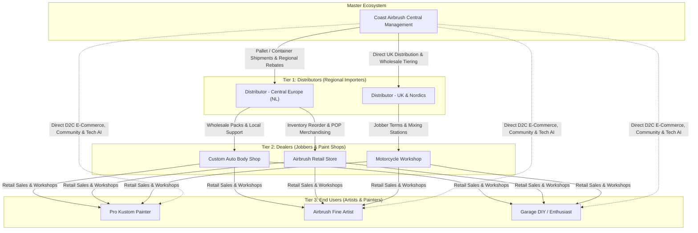
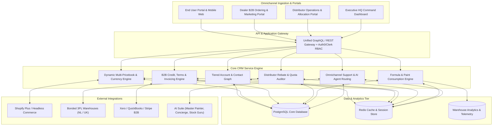

# World-Class Multi-Tier CRM Architecture: Coast Airbrush Paint System
*Tailored for End Users (Artists/Painters), Dealers (Local Jobbers/Shops), and Regional Distributors*

---

## 1. Strategic Client Taxonomy & Value Proposition Matrix

The CRM architecture is engineered around three distinct stakeholder personas with dedicated operational workflows, pricing mechanisms, and self-service portals.

---

### Comparative Segmentation Matrix

| Capability / Workflow | **End Users (B2C Pro/Hobbyist)** | **Dealers / Jobbers (B2B Tier 2)** | **Distributors (B2B Tier 1 / Regional)** |
| :--- | :--- | :--- | :--- |
| **Primary Goal** | Flawless finishes, color matching, fast shipping, community inspiration. | Healthy profit margins (30–45%), high inventory turns, reliable wholesale fulfillment. | Market exclusivity, high-volume pallet logistics, tiered rebate quotas, compliance. |
| **Ordering Model** | Single bottles, kits, flash drop items, pre-reduced pints. | Case packs, mixing system starter racks, point-of-sale displays (POP). | Full pallets, sea/air container loads, master drum concentrate / raw flake bulk. |
| **Pricing & Terms** | MSRP / Tier-based loyalty rewards; instant Stripe/Apple Pay/Klarna. | Dynamic Tier Pricing (Tier 1-3 wholesale); Net 30/60 with automated credit limits. | Master Wholesale Index (Cost+ or 50-60% off MSRP); Net 60/90, Letter of Credit, SEPA B2B. |
| **Key CRM Modules** | - Saved Formula Vault - AI Master Painter Chatbot - Gallery & Community Showcase - Refill Reminder Automation | - B2B Quick-Reorder Grid - Co-Op Marketing Budget Tracker - Warranty / Gun Repair RMA Intake - MAP (Minimum Advertised Price) Monitoring | - Regional Exclusivity Quota Tracker - Volume Rebate & Milestone Ledger - Bonded Warehouse Customs Sync - Multi-branch sub-dealer management |
| **Compliance Needs** | Standard consumer SDS & mixing ratio cheat-sheets. | Commercial ADR transport notes & localized batch certificates. | Full EU REACH, UK REACH, ADR bulk hazard manifests & localized MSDS in 8 languages. |

---

## 2. Core CRM System Architecture

---

## 3. Detailed CRM Functional Blueprints

### A. End User CRM Engine (B2C & Pro Solo Artists)
1. **Custom Color Vault & Formulation History**:
   - Stores exact mixing ratios (e.g., *70% Kroma Jet Black + 30% Cobalt Blue + 12% Flake King Micro Emerald*).
   - Instant re-order button from saved mixing formulas directly into the cart.
2. **AI-Driven Customer Lifecycle Automation**:
   - **Nozzle / Gun Wear Prompts**: Automated email/SMS check-ins after 6 months with discounts on needle/nozzle kits.
   - **Clearcoat Weather Alerts**: Push notification recommendations for Fast vs Slow reducers based on the customer's local weather forecast.
3. **VIP Loyalty & Showcase Tiers**:
   - **Tiers**: *Bronze (Hobbyist)* $\rightarrow$ *Silver (Garage Builder)* $\rightarrow$ *Gold (Master Custom Studio)*.
   - Auto-invitations to beta test new pearls, flakes, and candy concentrates.

---

### B. Dealer / Jobber CRM Engine (B2B Retail & Body Shops)
1. **Matrix Pricing & Instant Wholesale Quick-Ordering**:
   - SKU-level tiering: Case discounts (e.g., Box of 12 pints = 35% off; Starter Rack display = 42% off).
   - "One-Click Restock": Barcode scan sheet or CSV upload for instant replenishment.
2. **B2B Credit & Terms Management**:
   - Automated underwriting (CreditSafe / Euler Hermes API) for instant Net-30 limit approvals (£2,500 – £25,000).
   - Automated overdue balance reminders, dunning sequences, and credit hold automations.
3. **Co-Op Marketing & POP Collateral Management**:
   - Dealer requests free branded Coast Airbrush / Kroma Edge counter mats, banners, and sample spray-out cards.
   - Upload proof of local car show sponsorship to earn 50% matching product credit.
4. **Lead Passing System**:
   - When an End User asks for local in-person color matching, the CRM auto-routes the inquiry to the nearest certified Dealer with live inventory.

---

### C. Distributor CRM Engine (B2B Regional Importers & Logistics Hubs)
1. **Territory Exclusivity & Quota Milestone Tracker**:
   - Real-time gauge of minimum annual purchase commitments (e.g., €250,000/year for DACH region).
   - Automatic early warning triggers if distributor run-rate falls below 85% of quarterly pacing.
2. **Tiered Retro-Rebate Engine**:
   - End-of-Quarter volume calculations: e.g., 3% rebate on €50k+, 5% rebate on €100k+, 7.5% rebate on €250k+ applied as invoice credit note or wire transfer.
3. **Pallet Allocation & Customs Documentation Hub**:
   - Direct integration with bonded warehouse stocks (Netherlands & UK).
   - Instant 1-click generation of complete export packs: Commercial Invoices, Packing Lists, Certificates of Origin, and Multi-Lingual ADR Hazard Compliance declarations.
4. **Sub-Dealer Performance Rollup**:
   - Distributors can register and monitor authorized local stockists within their exclusive territory to avoid territory encroachment disputes.

---

## 4. Comprehensive Data Model (Relational Schema Design)

```mermaid
erDiagram
    ACCOUNT ||--o{ CONTACT : has
    ACCOUNT ||--o{ ORDER : places
    ACCOUNT ||--o{ CREDIT_LINE : holds
    ACCOUNT ||--o{ REBATE_AGREEMENT : contracts
    ACCOUNT ||--o{ FORMULA_VAULT : owns
    ACCOUNT ||--o{ SUPPORT_TICKET : logs

    ACCOUNT {
        uuid id PK
        string company_name
        string account_type "END_USER | DEALER | DISTRIBUTOR"
        string tier_level "RETAIL | PRO_PAINTER | JOBBER_T1 | DIST_EXCLUSIVE"
        string territory_code "UK | DE | FR | NORDICS | IBERIA"
        string vat_number
        string currency "EUR | GBP | USD"
        string status "ACTIVE | PENDING_REVIEW | SUSPENDED | CREDIT_HOLD"
        uuid parent_distributor_id FK
        timestamp created_at
    }

    CONTACT {
        uuid id PK
        uuid account_id FK
        string full_name
        string email
        string phone
        string role "OWNER | HEAD_PAINTER | PURCHASING_MGR | ACCOUNTING"
        boolean is_primary
    }

    PRICEBOOK ||--o{ PRICEBOOK_ENTRY : contains
    PRICEBOOK {
        uuid id PK
        string name "RETAIL_EUR | DEALER_TIER_1_GBP | DISTRIBUTOR_MASTER_EUR"
        string currency
        boolean is_active
    }

    PRICEBOOK_ENTRY {
        uuid id PK
        uuid pricebook_id FK
        string sku
        decimal unit_price
        integer min_order_quantity
        decimal volume_discount_percentage
    }

    CREDIT_LINE {
        uuid id PK
        uuid account_id FK
        decimal approved_credit_limit
        decimal current_outstanding_balance
        string payment_terms "PREPAY | NET_15 | NET_30 | NET_60 | NET_90"
        string credit_status "GOOD | WARNING | SUSPENDED"
    }

    REBATE_AGREEMENT {
        uuid id PK
        uuid account_id FK
        string period "Q1_2026 | ANNUAL_2026"
        decimal target_revenue_threshold
        decimal rebate_percentage
        decimal achieved_revenue
        decimal payout_amount
        string status "IN_PROGRESS | CALCULATED | DISBURSED"
    }

    FORMULA_VAULT {
        uuid id PK
        uuid account_id FK
        string formula_name "Midnight Pearl Violet 3-Stage"
        jsonb component_breakdown
        jsonb reducer_specs
        string notes
        boolean is_public_community
    }

    SUPPORT_TICKET {
        uuid id PK
        uuid account_id FK
        string title
        string channel "WEB | WHATSAPP | EMAIL | AI_ESCALATION"
        string category "TECHNICAL_APPLICATION | SHIPPING_LOGISTICS | INVOICING | WARRANTY"
        string priority "LOW | NORMAL | HIGH | URGENT"
        string status "NEW | AI_HANDLING | AGENT_PENDING | RESOLVED"
        string assigned_ai_agent "MASTER_PAINTER | CONCIERGE | NONE"
    }
```

---

## 5. Phased Implementation Roadmap

| Phase | Duration | Core Deliverables |
| :--- | :--- | :--- |
| **Phase 1: Foundation & Data Architecture** | Weeks 1–3 | Multi-tier RBAC schema, PostgreSQL migrations, Shopify customer & pricebook sync, Formula Vault for End Users. |
| **Phase 2: Dealer & Wholesale Engine** | Weeks 4–6 | Dealer Matrix ordering UI, automated Net 30/60 credit underwriting & dunning, Co-op marketing ledger & RMA portal. |
| **Phase 3: Distributor Hub & Logistics** | Weeks 7–9 | Territory quota tracking, retro-rebate engine, container/pallet optimizer, multi-lingual ADR/REACH export docs. |
| **Phase 4: AI Copilot Orchestration** | Weeks 10–12 | Master Painter AI & Concierge routing, burn-rate restock predictions, load testing & launch. |
