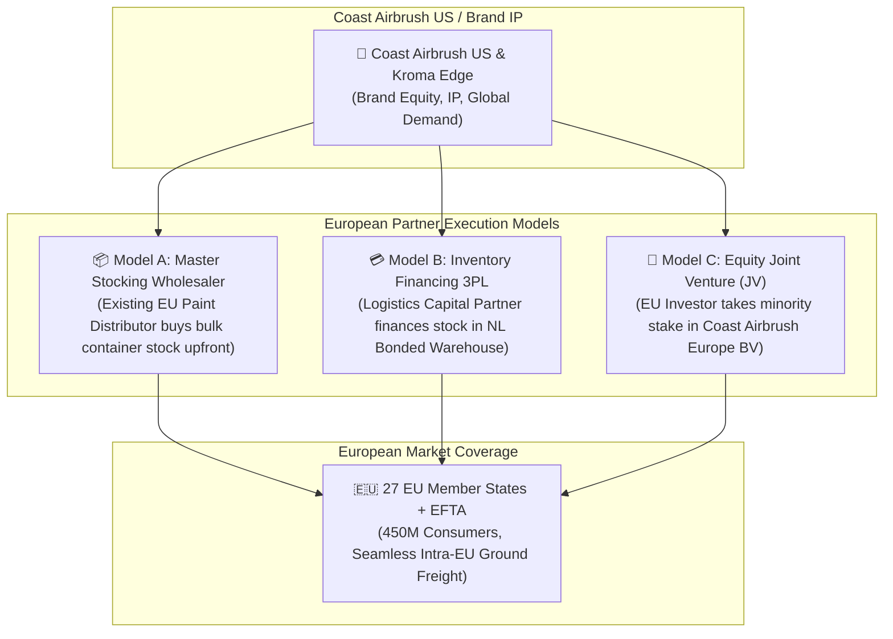

# European Partner Sourcing & Post-Brexit Logistics Comparison Guide
## Coast Airbrush Europe: Executive Strategy, Partner Pitch Architecture & Trade Model Analysis

> [!IMPORTANT]
> **Executive Summary**  
> This guide addresses two foundational strategic questions posed by the founder:
> 1. **Partner Sourcing**: How to identify, pitch, and structure an agreement with a European stocking and investment partner to finance and hold inventory in Continental Europe.
> 2. **Logistics Economics**: Why establishing an EU-based stocking hub provides overwhelming financial, tax, and dangerous goods advantages over shipping to EU customers from a UK warehouse.

---

## Part 1: Finding & Pitching a European Stocking & Investment Partner

### 1.1 Three Strategic Partner Models



#### Detailed Comparison of Partner Models:

| Dimension / Metric | Model A: Master Stocking Wholesaler | Model B: Inventory Financing 3PL | Model C: Equity Joint Venture (JV) |
| :--- | :--- | :--- | :--- |
| **Partner Profile** | Established European automotive paint / airbrush distributor (e.g., in Netherlands or Germany). | Specialized Dutch/German fulfillment 3PL offering asset-backed inventory trade lines (e.g., ModusLink, Bleckmann). | High-net-worth European custom automotive entrepreneur or strategic investor. |
| **Capital Commitment** | Buys €100k–€250k initial inventory upfront at wholesale discount (45–55% off MSRP). | Advances 70–80% of inventory import cost via asset-based line; repaid as stock sells. | Injects €200k–€500k cash equity into Coast Airbrush Europe BV for 20–35% equity. |
| **Operational Control** | Partner manages warehouse, packing, and local B2B dealer sales. | Coast Airbrush Europe retains 100% brand/sales control; 3PL handles physical fulfillment. | Joint board governance; shared management of European expansion. |
| **Hazmat Licensing** | Partner already holds EU ADR Class 3 Flammable Liquid warehouse licenses. | 3PL facility is fully ADR / Seveso III certified. | JV company leases compliant space or contracts ADR 3PL. |
| **Financial Return** | Partner earns 15–20% margin on B2B sub-dealer sales and 45–55% on B2C sales. | 3PL earns standard pick/pack fees + 6–9% APR inventory financing interest. | Investor receives equity dividend distribution from Coast Airbrush Europe BV profits. |

---

### 1.2 Target Sourcing Channels & Industry Events

To locate qualified European stocking partners, Coast Airbrush Europe will target three primary industry ecosystems:

```
                               ┌──────────────────────────────────────────┐
                               │   EUROPEAN PARTNER TARGET ECOSYSTEMS     │
                               └────────────────────┬─────────────────────┘
                                                    │
           ┌────────────────────────────────────────┼────────────────────────────────────────┐
           ▼                                        ▼                                        ▼
┌───────────────────────────┐            ┌───────────────────────────┐            ┌───────────────────────────┐
│ 1. TRADE SHOWS & EXPOS    │            │ 2. INDUSTRY DISTRIBUTORS  │            │ 3. LOGISTICS CAPITAL 3PLS │
│ - Automechanika Frankfurt │            │ - Mipa AG Jobber Network  │            │ - Dutch Bonded 3PLs       │
│ - Essen Motor Show        │            │ - Custom Creative (Spain) │            │ - Bleckmann / ModusLink   │
│ - Salon Auto Moto Paris   │            │ - Harder & Steenbeck Net  │            │ - Mainfreight Europe      │
└───────────────────────────┘            └───────────────────────────┘            └───────────────────────────┘
```

#### Specific Target Organizations & Sourcing Strategy:
1. **Existing European Paint Jobbers & Distributors**:  
   Target regional automotive body shop suppliers (e.g., Mipa jobbers in Germany, Custom Creative distributors in Spain, Createx Europe, Sparmax Europe). These entities already possess **ADR-compliant warehousing**, dangerous goods safety advisors (DGSAs), and established European courier accounts.
2. **Harder & Steenbeck & Anest Iwata European Dealer Network**:  
   Leverage existing hardware relationships to identify top-performing European airbrush distributors interested in securing exclusive distribution for **Kroma Edge** and **House of Kolor** solvent paints.
3. **Premier European Trade Events**:  
   - **Automechanika Frankfurt** (World's leading automotive aftermarket show): Ideal for meeting large-scale paint distributors.
   - **Essen Motor Show** (Europe's premier custom car & tuning exhibition): Ideal for meeting high-volume custom automotive paint jobbers.

---

### 1.3 The Master Pitch Deck Framework (Pitching European Partners)

When presenting to potential European partners, Coast Airbrush Europe offers an irresistible value proposition built on five core pillars:

```
Slide 1: Global Brand Authority ──► Slide 2: 100% Routed Traffic ──► Slide 3: Exclusive Territory ──► Slide 4: High Margins ──► Slide 5: Zero Credit Risk
(Coast Airbrush US & Kroma Edge)     (Direct API Web Leads)            (27 EU States + EFTA)            (40-50% Partner Margin)      (100% Upfront Customer Cash)
```

#### Pitch Deck Content Breakdown:

1. **Slide 1: The Coast Airbrush & Kroma Edge Empire**:  
   Highlight 30+ years of global leadership in custom automotive paint, airbrushing, and celebrity painter endorsements. Position Kroma Edge (Signal / Show Up) as the fast-growing solvent paint system in custom culture.
2. **Slide 2: The 100% Routed Web Traffic Guarantee**:  
   *The Ultimate Pitch Hook*: Coast Airbrush US, Signal / Show Up, and official manufacturer social channels will route **100% of European web traffic, jobber inquiries, and customer orders** directly to the partner's European inventory hub.
3. **Slide 3: Territorial Exclusivity**:  
   Offer exclusive Master Distribution rights for the 27 EU Member States and EFTA region, protected by strict contractual anti-bypass clauses.
4. **Slide 4: Generous Margin Structure**:  
   Provide the partner with **40% to 50% gross margins** on retail sales and 15–20% overriding margins on sub-dealer wholesale orders.
5. **Slide 5: 100% Upfront Cash Collection Policy**:  
   Demonstrate that all customer orders (B2C and B2B jobbers) pay **100% upfront** via credit card or SEPA Instant prior to shipment, guaranteeing the partner **zero bad debt or credit risk**.

---

## Part 2: EU Stocking vs UK-to-EU Shipping (Post-Brexit Analysis)

### 2.1 The Post-Brexit "Double Duty Trap"

The most significant financial argument for an EU stocking hub is the elimination of **Post-Brexit Double Duty Leakage**.

```
SCENARIO A: UK WAREHOUSE SHIPPING TO EU (DOUBLE DUTY TRAP)
[US/Japan Supplier] ──► Pays UK Duty (6.5%) ──► [UK Warehouse] ──► Ships to EU Customer ──► Pays EU Duty AGAIN (6.5%) = 13.0% TOTAL DUTY!

SCENARIO B: NETHERLANDS BONDED HUB (ZERO DOUBLE DUTY)
[US/Japan Supplier] ──► Bonded Suspension ──► [NL Bonded Warehouse] ──► Ships to EU Customer ──► Pays Single EU Duty (6.5%) or 0% REX = 0% - 6.5% DUTY!
```

#### Detailed Duty Analysis:
- Goods manufactured in the US (House of Kolor) or Japan (Anest Iwata) cleared into a UK warehouse pay UK customs duty upon import.
- Under post-Brexit Rules of Origin (UK-EU Trade and Cooperation Agreement), foreign-made goods cleared into the UK **do NOT acquire UK origin**.
- When re-shipped from the UK to an EU customer, **EU customs duty (6.5% for paint) is charged a second time** at the EU border.
- **Financial Impact**: Operating out of a UK warehouse burns **6.5% of gross revenue** in redundant duty leakage. An EU bonded hub completely eliminates this tax trap.

---

### 2.2 Dangerous Goods (UN1263 Class 3) Shipping Surcharge Comparison

Kroma Edge and House of Kolor solvent paints are classified under **UN1263 Class 3 Flammable Liquids**. Shipping hazardous solvent liquids across international borders incurs severe freight penalties compared to domestic intra-EU ground freight:

```
PARCEL HAZMAT FREIGHT COST COMPARISON (UN1263 Solvent Paint Quart):

UK-to-EU Cross-Border Parcel Freight:  ████████████████████ €45.00 - €95.00 / package
Intra-EU ADR Limited Quantity Ground:  ████ €6.00 - €12.00 / package
```

#### Freight & Regulatory Breakdown:

| Logistics Dimension | UK Warehouse shipping to EU Customer | EU Stocking Hub (NL 3PL) shipping to EU Customer |
| :--- | :--- | :--- |
| **Transport Mode** | Cross-border air cargo or international maritime channel. | Intra-EU ground road freight (DHL Ground, DPD, PostNL). |
| **Hazmat Classification** | Full IATA / International ADR Dangerous Goods declaration. | **ADR Limited Quantity (LQ)** road exemption (\(\le 5\text{L}\) inner / \(\le 30\text{kg}\) outer). |
| **Carrier Surcharge** | **£35.00 – £85.00 (€40–€95)** per package Hazmat fee. | **€0.00** (Waived under ADR LQ ground exemptions). |
| **Standard Freight Rate** | £18.00 – £30.00 (€21–€35) parcel rate. | €6.00 – €12.00 standard intra-EU ground rate. |
| **TOTAL SHIPPING COST PER PARCEL** | **€61.00 – €130.00 EUR** | **€6.00 – €12.00 EUR** |
| **Border Inspection Friction** | ❌ **High Risk**: Parcels frequently delayed or rejected by French/Dutch customs border officials for Hazmat paper errors. | 🟢 **Zero Customs Border**: Seamless transit across all 27 Schengen countries without customs stop. |

> [!WARNING]
> **Commercial Impact on B2C E-Commerce Conversion**  
> A customer buying a €45 bottle of custom solvent paint will **abandon their cart** if shipping costs €75 due to cross-border UK-EU Hazmat surcharges. An EU stocking hub lowers shipping to €8, increasing e-commerce conversion rates by estimated **300%–400%**.

---

### 2.3 Comprehensive Logistics & Tax Comparison Matrix

Evaluating all dimensions of shipping from a UK Warehouse vs an EU Stocking Hub:

| Strategic Dimension | UK-to-EU Cross-Border Fulfillment | EU Stocking Hub (Netherlands / Germany) | Advantage |
| :--- | :--- | :--- | :--- |
| **Customs Duty Leakage** | Pays double duty (UK duty + EU duty on re-export). | Single EU duty or **0% Duty** under EU-Japan EPA (REX). | 🟢 **EU Hub (+6.5% Margin)** |
| **Hazmat Freight Cost** | High cross-border Hazmat surcharges (€60–€130/pkg). | Low-cost ADR Limited Quantity ground freight (€6–€12/pkg). | 🟢 **EU Hub (85% Freight Savings)** |
| **Delivery Speed** | 4 to 8 Business Days (Customs delays at Calais). | **24 to 48 Hours** (Next-Day to DE/NL/BE/FR). | 🟢 **EU Hub (3x Faster)** |
| **VAT Administration** | Carrier collects import VAT + €15–€30 handling fee from customer at door (High customer friction). | **EU One Stop Shop (OSS)**: Destination VAT collected cleanly at checkout. Zero door fees. | 🟢 **EU Hub (Frictionless)** |
| **B2B Jobber Sales** | EU body shops reject buying from UK due to complex import customs filings. | Zero-rated intra-EU B2B reverse charge invoicing via VIES. Seamless trade. | 🟢 **EU Hub (Unlocks B2B Network)** |
| **Returns & Exchanges** | Complex reverse cross-border customs declarations for returned paints. | Simple local return to Netherlands warehouse. | 🟢 **EU Hub (Low Return Cost)** |

---

## Executive Summary & Strategic Recommendation

```
                              ┌─────────────────────────────────────────┐
                              │     RECOMMENDED DUAL-LOGISTICS MODEL    │
                              └────────────────────┬────────────────────┘
                                                   │
                    ┌──────────────────────────────┴──────────────────────────────┐
                    ▼                                                             ▼
┌───────────────────────────────────────┐                     ┌───────────────────────────────────────┐
│     NETHERLANDS BONDED 3PL HUB        │                     │         UK DOMESTIC 3PL HUB           │
│  - Serves 27 EU Member States         │                     │  - Serves UK Domestic Market          │
│  - Zero Double Duty / ADR LQ Ground   │                     │  - 20% UK VAT with PVA                │
│  - Financed via EU Stocking Partner   │                     │  - Next-Day UK Courier Delivery       │
└───────────────────────────────────────┘                     └───────────────────────────────────────┘
```

### Direct Answers to Founder Questions:

1. **How to find a European stocking partner?**  
   Target established European paint jobbers (Mipa, Custom Creative networks) and Dutch/German 3PL logistics capital partners via **Automechanika Frankfurt** and **Essen Motor Show**. Pitch them using our 5-slide deck offering exclusive territory, 40-50% gross margins, and **100% routed web traffic** backed by a 100% upfront cash payment policy.
2. **What benefit does EU stocking offer over shipping from the UK?**  
   - Eliminates **6.5% double customs duty leakage**.
   - Reduces Hazmat parcel shipping costs from **€60-€130 down to €6-€12** via ADR Limited Quantity ground exemptions.
   - Speeds up delivery from 4-8 days down to **24-48 hours**.
   - Eliminates customer doorstep import fees through seamless **EU OSS VAT**.
