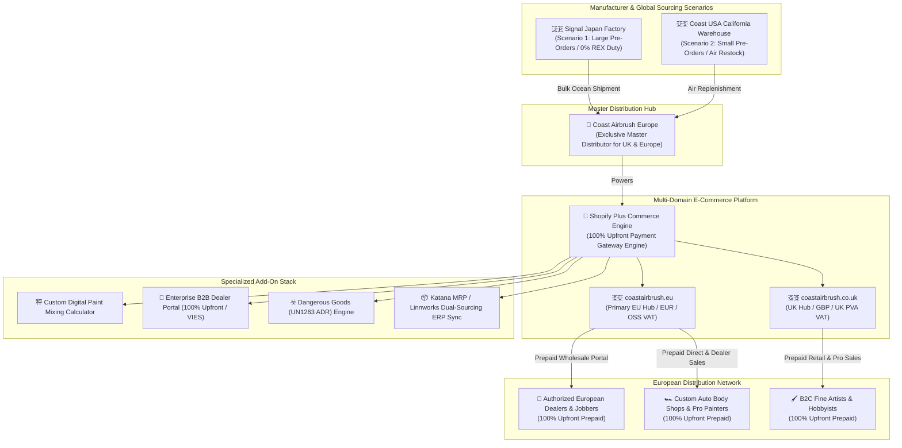

# Kroma Edge Master Distribution & Shopify E-Commerce Ecosystem Blueprint
## Coast Airbrush Europe: Technical Architecture, Platform Appraisal & Add-On Stack Analysis

> [!IMPORTANT]
> **Executive Mandate & Dual-Sourcing Update**  
> This master blueprint establishes the distribution model for **Kroma Edge** solvent-based custom paints (manufactured by Signal / Show Up), designs the dual-domain architecture (`coastairbrush.eu` and `coastairbrush.co.uk`), presents an authoritative platform appraisal for Shopify Plus, and defines the complete enterprise add-on tech stack.
>
> **DUAL-SOURCING SUPPLY CHAIN MANDATE**:
> - **Scenario 1 (Large Bulk Pre-Orders)**: Shipped direct from Signal Japan to NL/UK 3PL hubs via bulk ocean cargo. Commercial invoicing via Coast USA, clearing at **0% Preferential Duty** under EU-Japan EPA / UK-Japan CEPA via Signal Japan's REX origin declaration (**Landed Cost: €37.20 / Gross Margin: 68.99%**).
> - **Scenario 2 (Small Pre-Orders / Air Restock)**: Shipped direct from Coast USA warehouse in California via air freight, subject to standard MFN tariffs (6.5% paints, 1.7% hardware) (**Landed Cost: €59.20 / Gross Margin: 50.65%**).

---

## Strategic Architecture Overview



---

## Section 1: Kroma Edge Master Distribution Architecture

### 1.1 Dual-Sourcing Fulfillment Matrix

| Operational Metric | Scenario 1: Large Bulk Pre-Orders (Japan Ocean) | Scenario 2: Small Restocks (US Air) |
| :--- | :--- | :--- |
| **Physical Origin** | Signal Japan Factory (Yokohama/Tokyo) | Coast USA Warehouse (California) |
| **Commercial Invoicing** | Coast USA Inc | Coast USA Inc |
| **Inbound Logistics** | Bulk Ocean FCL/LCL (Port of Rotterdam / Felixstowe) | Air Cargo / Express LCL (Schiphol / Heathrow) |
| **Customs Duty Rate** | **0.0% Preferential Tariff** (EU-Japan EPA REX) | **6.5% MFN Tariff** (Solvent Paints HS 3208) |
| **Landed Cost (Paint Kit)**| **€37.20 EUR** | **€59.20 EUR** |
| **Gross Margin (%)** | **68.99%** | **50.65%** |
| **Operational Role** | Primary planned pre-order & seasonal container supply | Rapid backup buffer to eliminate stockout risk |

---

## Section 2: Domain Architecture & Global Multi-Storefront Routing

### 2.1 Multi-Domain Routing Architecture

Managed via **Shopify Markets** with Cloudflare Workers Geo-IP redirection (`coastairbrush.eu` for 27 EU Member States in EUR; `coastairbrush.co.uk` for UK in GBP) with `hreflang` canonicalization (`en-gb`, `en-eu`, `de-de`, `x-default`).

---

## Section 3: Shopify Add-On Stack & ERP Dual-Sourcing Workflow

### 3.1 Katana MRP & Linnworks Procurement Logic

```
                               ┌────────────────────────────────┐
                               │  SHOPIFY PLUS ORDER ENGINE     │
                               └───────────────┬────────────────┘
                                               │
                                               ▼
                               ┌────────────────────────────────┐
                               │ Katana MRP Inventory Analyzer  │
                               └───────────────┬────────────────┘
                                               │
                    ┌──────────────────────────┴──────────────────────────┐
                    ▼                                                     ▼
┌───────────────────────────────────────┐             ┌───────────────────────────────────────┐
│     BATCH SIZE \ge CONTAINER THRESHOLD  │             │     EMERGENCY LOW STOCK TRIGGER       │
└───────────────────┬───────────────────┘             └───────────────────┬───────────────────┘
                    │                                                     │
                    ▼                                                     ▼
┌───────────────────────────────────────┐             ┌───────────────────────────────────────┐
│ Route Purchase Order to Signal Japan  │             │ Route Purchase Order to Coast USA WH  │
│ - Mode: Bulk Ocean Cargo              │             │ - Mode: Air Cargo / Express LCL       │
│ - Tariff: 0.0% EPA REX Statement      │             │ - Tariff: 6.5% MFN Tariff             │
│ - Landed Cost: €37.20 (Margin 69%)    │             │ - Landed Cost: €59.20 (Margin 51%)    │
└───────────────────────────────────────┘             └───────────────────────────────────────┘
```

---

## Technical Integration & Implementation Checklist

> [!CHECKLIST]
> **Shopify & ERP Launch Milestones**
> - [ ] **Signal Japan REX Registration**: Embed Signal Japan REX ID on Katana purchase order templates.
> - [ ] **Katana MRP Sourcing Rules**: Configure automated purchase order routing for Scenario 1 (Japan Ocean) and Scenario 2 (US Air).
> - [ ] **Custom Paint Mixing Calculator**: Deploy mixing ratio calculator extension on `coastairbrush.eu` and `coastairbrush.co.uk`.
> - [ ] **100% Upfront B2B Gateway**: Enforce upfront card/SEPA payment on Shopify Plus B2B portals prior to releasing orders to Dutch/UK 3PLs.
