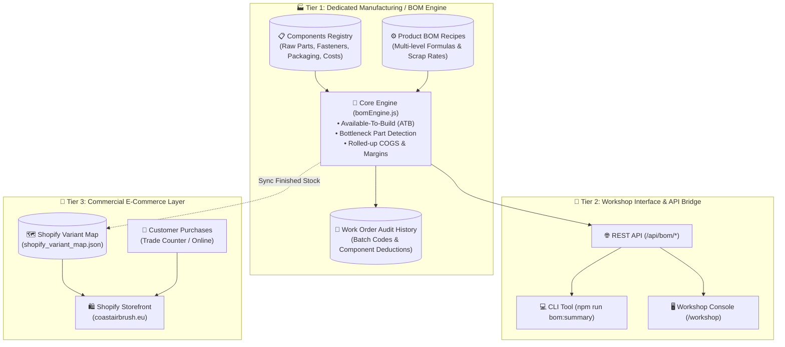

# Coast Airbrush Europe: Manufacturing Bill of Materials (BOM) & MRP System Architecture

> [!IMPORTANT]
> **Core Architectural Principle**  
> **Shopify is an order-taking and commercial storefront engine, NOT a manufacturing or BOM database.**  
> - **Shopify manages**: Sellable Finished Goods, customer-facing prices, product imagery, checkout, and order capture.  
> - **The BOM Engine manages**: Multi-level assemblies, raw materials, CNC parts, fasteners, packaging consumables (boxes, foam, labels), Available-To-Build (ATB) simulations, supplier lead times, and rolled-up Cost of Goods Sold (COGS).  
> - **The Integration**: The BOM Engine calculates physical on-shelf finished stock and syncs that exact number to Shopify so you never oversell.

---

## 1. System Architecture Overview



---

## 2. Why BOMs Must Be Kept Separate from Shopify

| Manufacturing Concern | If Stored in Shopify | Built in Dedicated BOM System (`bom-engine/`) |
| :--- | :--- | :--- |
| **Multi-Level Part Explosions** | ❌ Not supported natively. Only 3 flat variant options (`Size`, `Color`, etc.). | ✅ **Unlimited nested components**: Frame, knobs, magnets, washers, boxes, foam, manuals. |
| **Shared Hardware Across Kits** | ❌ Double-counts or requires complex third-party bundling plugins. | ✅ **Single source of truth**: The same 30g glass jar (`FK-JAR-30`) or M6 wing knob (`VAX-6W-KNB-M`) deducts correctly whether sold as a spare or consumed in a Flake King gun assembly. |
| **Packaging & Consumables** | ❌ Cannot track unpriced items like die-cut foam trays, corrugated boxes, and thermal labels. | ✅ Tracks all packaging inventory with supplier reorder thresholds. Prevents the common disaster: *"We have the metal parts to build 50 jigs, but only 2 boxes left to ship them in."* |
| **Dynamic COGS Roll-up** | ❌ Manual entry on each product variant. | ✅ Automatically calculates: $\text{Raw Materials} + \text{Packaging} + \text{Assembly Labor} = \text{Landed COGS}$ and live Gross Margin %. |
| **Assembly Work Orders** | ❌ No concept of shop-floor assembly runs. | ✅ Deducts raw parts, adds finished goods, generates batch codes (`WO-YYYYMMDD-XXXX`), and creates audit logs. |

---

## 3. Product BOM Breakdowns in Coast Airbrush Europe

### 🏒 Product 1: VsionAir Ice Hockey Goalie Mask Jig (`VAX-JG-GLMSK`)
* **Retail Price**: £110.39 (€129.16)
* **Direct Assembly Labor**: 20 minutes @ £36/hr = **£12.00**
* **Materials & Packaging**: **£47.69**
* **Total Landed COGS**: **£59.69** (Gross Margin: **45.9%**)

```
[VAX-JG-GLMSK] VsionAir Ice Hockey Goalie Mask Jig
 ├── 1x  VAX-FRAME-GLMSK    (CNC Anodized Headframe & Spine)        [Apex Precision CNC]
 ├── 3x  VAX-6W-KNB-M       (M6 Male Wing Knobs)                     [WDS Components]
 ├── 2x  VAX-6W-KNB-F       (M6 Female Threaded Wing Knobs)          [WDS Components]
 ├── 4x  VAX-6R-WSHR        (M6 Neoprene Friction Washers)           [Polymax Gaskets]
 ├── 4x  VAX-6S-WSHR        (M6 Form A Stainless Washers)            [Orbital Fasteners]
 ├── 1x  VAX-MAG-NEO-50     (50mm Neodymium Pot Magnet)              [First4Magnets]
 ├── 1x  PKG-BOX-VAX-JIG    (Heavy Fluted Corrugated Transit Box)    [Rajapack UK]
 ├── 1x  PKG-FOAM-VAX-JIG   (Laser-Cut High-Density EVA Foam Tray)   [Custom Foam Solutions]
 ├── 1x  DOC-MAN-VAX-JIG    (A5 4-Page Offset Color Manual)          [Instantprint UK]
 └── 1x  LBL-BARCODE-TSPL   (Citizen Synthetic Barcode Label)        [Citizen UK]
```

### 💨 Product 2: Flake King 1000 Dry Metal Flake Gun (`FOM1000`)
* **Retail Price**: £109.95 (€128.64)
* **Direct Assembly Labor**: 15 minutes @ £36/hr = **£9.00**
* **Materials & Packaging**: **£41.31**
* **Total Landed COGS**: **£50.31** (Gross Margin: **54.2%**)

```
[FOM1000] Flake King 1000 Dry Metal Flake Gun
 ├── 1x  FK-BODY-1000       (Cast & Anodized Billet Chassis)         [Signal Japan]
 ├── 1x  FK-TUBE-VENTURI    (Patented Brass Venturi Agitation Tube)  [Signal Japan]
 ├── 1x  FK-VALVE-AIR       (In-Line Brass Needle Metering Valve)    [Pisco Japan]
 ├── 1x  FK-NOZZLE-SET      (3-Piece Color-Coded Precision Nozzles)  [Signal Japan]
 ├── 1x  FK-JAR-30          (30g Direct-Mount Borosilicate Jar)      [Adelphi Glass]
 ├── 1x  FK-FIT-14BSP       (1/4" BSP European Quick-Connect Plug)   [PCL Pneumatics]
 ├── 1x  PKG-BOX-FK1000     (Full-Color UV Laminated Retail Box)     [Saxon Packaging]
 ├── 1x  PKG-FOAM-FK1000    (Molded Charcoal Inner Foam Nest)        [Custom Foam Solutions]
 ├── 1x  DOC-MAN-FK1000     (A5 Technical Setup Sheet & Sizing)      [Instantprint UK]
 └── 1x  LBL-BARCODE-TSPL   (Citizen Synthetic Barcode Label)        [Citizen UK]
```

---

## 4. Key Capabilities of the BOM Engine

### 1. Available-To-Build (ATB) & Bottleneck Detection
For any finished product, the system calculates:
$$\text{Max Buildable for Component } i = \left\lfloor \frac{\text{Stock On Hand}_i}{\text{Required Qty}_i \times (1 + \text{Scrap Factor}_i)} \right\rfloor$$
$$\text{Available-To-Build} = \min_{i} (\text{Max Buildable}_i)$$

The system flags the specific component with the lowest value as the **Primary Bottleneck**, warning you which supplier to order from and the days of lead time needed.

### 2. Assembly Work Order Execution
When the workshop team assembles a batch:
1. Validates that the requested quantity is $\le \text{Available-To-Build}$.
2. Deducts the exact component quantities (including scrap allowance) from raw inventory.
3. Increments the finished goods stock count.
4. Generates an immutable batch record (`WO-YYYYMMDD-XXXX`).
5. Updates `shopify_variant_map.json` so the online store automatically reflects the new inventory.

### 3. Purchasing & Reorder Alerts
Any raw component, fastener, or packaging item that falls below its designated safety threshold is flagged with:
* Current stock vs. minimum threshold.
* Supplier name & lead time in days.
* Suggested economic reorder quantity ($2 \times \text{Threshold}$).

---

## 5. How to Use the System

### A. Via the Command Line (CLI)
```bash
# View complete workshop summary (finished stock, ATB, bottlenecks, and reorder alerts)
npm run bom:summary

# Check detailed Available-To-Build breakdown for a specific product
node bom-engine/cli.js --atb VAX-JG-GLMSK

# Check itemized rolled-up COGS & gross margin
node bom-engine/cli.js --cogs FOM1000

# Execute a workshop assembly work order (e.g. Build 5 units of Flake King 1000)
node bom-engine/cli.js --build FOM1000 5 --tech="John Miller"

# View all components requiring supplier purchase orders
node bom-engine/cli.js --reorder
```

### B. Via the Workshop Web Console
1. Start the server:
   ```bash
   npm start
   ```
2. Open your browser to:
   `http://localhost:3013/workshop`
3. Use the interactive console to:
   * View live Available-To-Build counts and bottleneck alerts.
   * Click **"🔍 Explode BOM"** to see every single part, on-hand count, and scrap factor.
   * Click **"⚙️ Assemble"** to execute a work order with 1 click!

---

## 6. Verification & Automated Testing
The BOM engine is fully wired into the main project test runner:
```bash
npm test
```
All 7 unit tests pass with zero regressions:
* Data integrity & multi-level recipe loading.
* Accurate Available-To-Build math.
* Bottleneck detection.
* Rolled-up COGS and margin roll-up calculations.
* Low-stock reorder triggers.
* Component deduction and finished goods incrementing.
* Over-assembly prevention guards.
