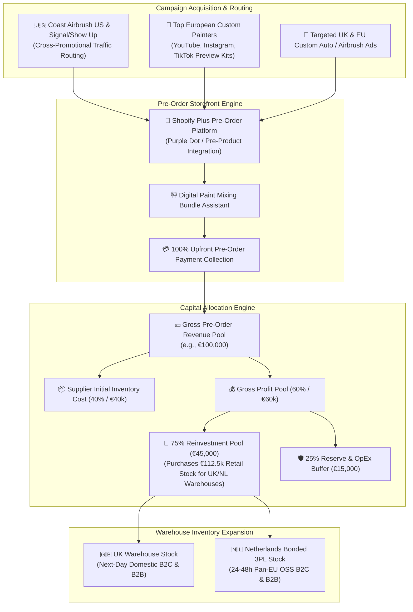
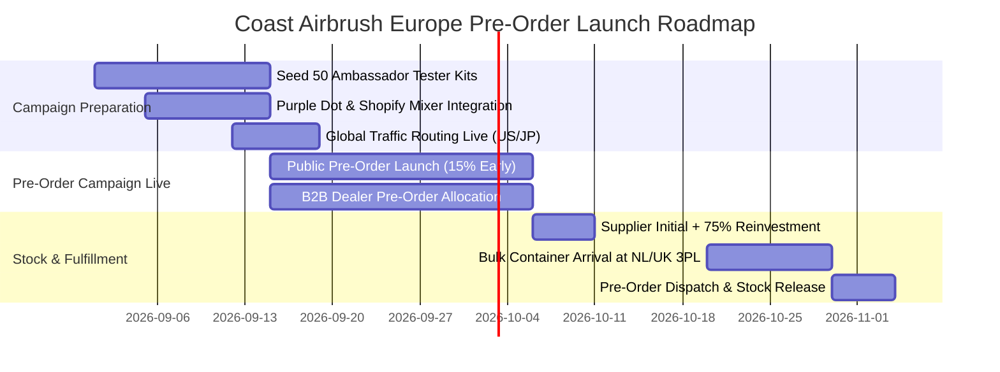

# Coast Airbrush Europe: Pre-Order Launch & 75% Gross Profit Reinvestment Strategy Blueprint

> [!IMPORTANT]
> **Executive Mandate & Founder Reinvestment Directive**  
> Coast Airbrush Europe will launch using a high-velocity **Pre-Order Business Model** to validate demand, generate immediate cash flow, and build initial inventory holdings without external debt. The founder has committed **75% of initial pre-order gross profits** directly back into purchasing additional stock for the UK and Netherlands fulfillment hubs. This blueprint establishes the promotional campaign architecture, the mathematical reinvestment engine, and the Shopify pre-order tech stack.

---

## Strategic Growth Engine Architecture



---

## Section 1: Pre-Order Promotional Campaign Architecture

### 1.1 Tiered Early Bird Incentive Structures

To maximize pre-order conversion rates and incentivize upfront commitment from both retail painters and wholesale dealers, Coast Airbrush Europe will deploy a 3-tier promotional offering:

```
                          ┌──────────────────────────────────────────┐
                          │    PRE-ORDER PROMOTIONAL TIERS           │
                          └────────────────────┬─────────────────────┘
                                               │
           ┌───────────────────────────────────┼───────────────────────────────────┐
           ▼                                   ▼                                   ▼
┌───────────────────────────┐     ┌───────────────────────────┐     ┌───────────────────────────┐
│ TIER 1: FOUNDING PAINTER  │     │ TIER 2: B2B DEALER        │     │ TIER 3: MASTER CUSTOM     │
│ B2C PACKAGE               │     │ PRIORITY ALLOCATION       │     │ PRO PAINTER SUITE         │
│ - 15% Early Bird Discount │     │ - Priority Warehouse Stock│     │ - Complete Kroma Edge Set │
│ - Free Solvent Stir Scale │     │ - Free Merch Counter Display│    │ - Harder & Steenbeck Gun  │
│ - Limited Collector Apron │     │ - Guaranteed Dispatch     │     │ - Serialized Metal Badge  │
└───────────────────────────┘     └───────────────────────────┘     └───────────────────────────┘
```

#### Detailed Promotional Package Matrix:

| Package Tier | Target Customer | Pricing & Incentive | Contents & Benefits |
| :--- | :--- | :--- | :--- |
| **1. Founding Painter Package** | B2C Fine Artists & Hobbyists | **15% off MSRP** (€119.95 vs €139.95 MSRP) | 1x Kroma Edge Basecoat Kit, 1x Ace of Shades Reducer, Exclusive "Founding European Artist" Apron & Stir Scale. |
| **2. B2B Dealer Priority Allocation** | Authorized UK/EU Jobbers & Auto Body Shops | **40% Wholesale Discount** + **Guaranteed Priority Allocation** | Minimum €2,500 pre-order. Guarantees shipment from the first container arrival at the Netherlands 3PL hub before general retail stock release. Free branded counter display. |
| **3. Master Custom Pro Suite** | Elite Automotive Custom Painters | **20% off MSRP** (€499.00 bundle) | Full Kroma Edge Color Spectrum set, Harder & Steenbeck Infinity Airbrush, Ace of Shades Custom Pigments, and serialized laser-etched metal Founding Member plaque. |

---

### 1.2 Influencer & Ambassador Preview Kit Campaign

Before public pre-order launch, Coast Airbrush Europe will seed **50 Exclusive Pre-Release Tester Kits** to top European custom automotive painters, airbrush artists, and motorcycle builders across YouTube, Instagram, and TikTok:

- **Target Geographic Reach**: Germany, UK, France, Netherlands, Italy, Spain, Scandinavia.
- **Ambassador Unboxing & Spray Test Protocol**:  
  - Ambassadors receive unreleased Kroma Edge paint jars, Ace of Shades reducers, and custom mixing cups 3 weeks prior to public launch.
  - Video briefs focus on **spray atomization, color coverage depth, solvent flash-off time, and compatibility with Iwata / Harder & Steenbeck airbrushes**.
- **Affiliate & Pre-Order Tracking**:  
  Each ambassador is assigned a unique Shopify pre-order link and discount code (e.g. `DANNY-CUSTOMS-10`), providing 10% off for their followers and a 7% commission for the ambassador.

---

### 1.3 Signal / Show Up & Coast Airbrush US Cross-Promotional Traffic Engine

To channel established brand equity into the European pre-order launch, Coast Airbrush Europe will leverage official global brand assets:

1. **Official Store Locator Routing**: Signal / Show Up (Japan/US) and Coast Airbrush US will update their international dealer locators and website popups:
   > *"European Customer? Pre-order your Kroma Edge & House of Kolor inventory directly from Coast Airbrush Europe for zero import tax friction and local EU/UK shipping."*
2. **Co-Branded Email Blast & Social Takeover**: Joint email announcement to 150,000+ global airbrush subscribers announcing the official opening of European pre-orders on `coastairbrush.eu` and `coastairbrush.co.uk`.

---

## Section 2: Mathematical Working Capital & 75% Reinvestment Engine

### 2.1 Theoretical Reinvestment Formula

By committing 75% of gross profits back into inventory replenishment, Coast Airbrush Europe achieves exponential inventory compounding without debt financing or equity dilution:

$$\begin{aligned}
R_n &= \text{Pre-Order Gross Revenue in Cycle } n \\
COGS_n &= R_n \times (1 - \text{Gross Margin \%}) \\
GP_n &= R_n \times \text{Gross Margin \%} \\
I_{reinvest} &= GP_n \times 0.75 \\
V_{new\_retail} &= \frac{I_{reinvest}}{1 - \text{Gross Margin \%}} \\
\text{Total Warehouse Inventory Asset Base} &= \text{Stock}_0 + V_{new\_retail}
\end{aligned}$$

Where:
- Average Gross Margin across B2C/B2B blended pre-order mix = **60%** (\(COGS = 40\%\)).
- Inventory Multiplier Factor = \(\frac{1}{0.40} = 2.50\times\) (every €1 of reinvested cost buys €2.50 of retail stock value).

---

### 2.2 Numerical Worked Example: €100,000 Pre-Order Launch Campaign

Let's calculate the exact cash allocation and inventory expansion generated by a **€100,000 initial pre-order launch**:

#### Assumptions:
- **Total Pre-Order Gross Revenue Collected**: **€100,000 EUR** (100% cash paid upfront).
- **Blended Product Sales Mix**: 60% B2C Retail / 40% B2B Wholesale.
- **Blended Gross Margin**: **60.0%** (€60,000 Gross Profit / €40,000 Initial Stock Cost).

```
                            ┌─────────────────────────────────────────┐
                            │    €100,000 PRE-ORDER REVENUE POOL      │
                            └────────────────────┬────────────────────┘
                                                 │
                    ┌────────────────────────────┴────────────────────────────┐
                    ▼                                                         ▼
┌───────────────────────────────────────┐                 ┌───────────────────────────────────────┐
│  INITIAL PRE-ORDER COGS (40%)         │                 │  GROSS PROFIT POOL (60%)              │
│  - Paid to US/JP/DE Suppliers         │                 │  - Total Gross Profit: €60,000         │
│  - Supplier Invoice: €40,000          │                 └───────────────────┬───────────────────┘
└───────────────────────────────────────┘                                     │
                                            ┌─────────────────────────────────┴─────────────────────────────────┐
                                            ▼                                                                   ▼
                             ┌───────────────────────────────┐                   ┌───────────────────────────────┐
                             │ 75% REINVESTMENT POOL         │                   │ 25% RESERVE & OPEX POOL       │
                             │ - Reinvestment Cash: €45,000  │                   │ - Working Capital Reserve:    │
                             │ - Supplier Cost Factor: 40%   │                   │   €15,000 EUR                 │
                             │ - NEW STOCK VALUE:            │                   │ - Covers local 3PL handling,  │
                             │   €112,500 RETAIL VALUE       │                   │   merchant fees & software.   │
                             └──────────────┬────────────────┘                   └───────────────────────────────┘
                                            │
                                            ▼
                             ┌───────────────────────────────┐
                             │ TOTAL WAREHOUSE ASSETS        │
                             │ - Initial Pre-Order Stock:    │
                             │   €100,000                    │
                             │ - Reinvested Inventory:       │
                             │   €112,500                    │
                             │ TOTAL STOCK: €212,500         │
                             └───────────────────────────────┘
```

#### Step-by-Step Financial Breakdown Table:

| Financial Metric | Amount (€ EUR) | % of Gross Revenue | Strategic Purpose |
| :--- | :--- | :--- | :--- |
| **Gross Pre-Order Cash Collected** | **€100,000** | 100.0% | Upfront customer funds collected prior to warehouse release. |
| **Initial Pre-Order Stock Cost (COGS)** | **€40,000** | 40.0% | Covers supplier FOB costs, ocean freight, and import duty for pre-ordered goods. |
| **Gross Profit Generated** | **€60,000** | 60.0% | Profit margin available for capital allocation. |
| **75% Inventory Reinvestment Pool** | **€45,000** | 45.0% | **Directly committed to purchasing secondary stock for UK & EU warehouses.** |
| **25% Operational Reserve Buffer** | **€15,000** | 15.0% | Retained cash reserve for 3PL pick/pack fees, merchant processing, and software. |
| **NEW Secondary Stock Purchased (at FOB)** | **€45,000** | — | Cost of additional inventory ordered alongside pre-order container. |
| **Retail Value of NEW Secondary Stock** | **€112,500** | — | Value of immediate buffer stock available in UK/EU 3PLs for post-launch sales. |
| **TOTAL WAREHOUSE STOCK BASE AFTER LAUNCH** | **€212,500** | **212.5%** | **Expands inventory asset base by >2x without debt or loan interest.** |

> [!NOTE]
> **Warehouse Allocation of Reinvested Stock (€112,500 Retail Value)**:
> - **Netherlands Bonded 3PL Hub**: €75,000 retail stock (66.7%) serving pan-European B2C and B2B OSS jobbers.
> - **UK 3PL Hub**: €37,500 retail stock (33.3%) serving domestic UK e-commerce and body shops.

---

## Section 3: Shopify Pre-Order Tech Stack & Customer Experience Architecture

### 3.1 Specialized Pre-Order Platform App Appraisal

To execute a seamless pre-order experience on Shopify Plus without custom backend bloat, we evaluate two enterprise pre-order platforms:

```
Pre-Order Platform Evaluation:

Purple Dot Engine   ████████████████████ 100% Dedicated Pre-Order Vault | Delayed Capture | Auto-Refunds
Pre-Product App     ████████████████░░░░ Flexible Deposit Engine | Custom Timelines | Strong B2B
Shopify Native API  ████████████░░░░░░░░ Basic Pre-order Selling Plans | Limited Logistics Visibility
```

#### Recommendation: **Purple Dot - Enterprise Pre-Order Engine for Shopify Plus**
- **Vaulted Deferred / Upfront Charge Options**: Supports both immediate 100% upfront card capture and authorized payment vaulting.
- **Dedicated Pre-Order Shopper Portal**: Allows customers to track their batch manufacturing status (e.g. *"Batch 1: Container in Transit to Rotterdam - Estimated Dispatch Oct 15"*), update shipping addresses, or request self-service cancellations prior to warehouse processing.
- **Automated ERP Holding State**: Holds pre-orders in a custom Shopify `Pre-Order` state, preventing premature transmission to Katana MRP / Linnworks until container stock arrives at the 3PL.

---

### 3.2 Integration with Proprietary Digital Paint Mixing Calculator

The pre-order storefront will seamlessly link the pre-order engine with our proprietary **Digital Paint Mixing Calculator**:

```
                              ┌─────────────────────────────────────────┐
                              │  CUSTOM PAINT MIXING CALCULATOR APP     │
                              └────────────────────┬────────────────────┘
                                                   │
                                                   ▼
                              ┌─────────────────────────────────────────┐
                              │ User Selects: Vehicle Type & Surface Sq Ft│
                              │ Ratios Computed: Basecoat + Reducer     │
                              └────────────────────┬────────────────────┘
                                                   │
                                                   ▼
                              ┌─────────────────────────────────────────┐
                              │ "PRE-ORDER COMPLETE PAINT SYSTEM KIT"   │
                              │ Single Button Bundles SKUs into Cart    │
                              │ Applies 15% Pre-Order Discount          │
                              └────────────────────┬────────────────────┘
                                                   │
                                                   ▼
                              ┌─────────────────────────────────────────┐
                              │ PURPLE DOT PRE-ORDER CHECKOUT           │
                              │ Displays Clear Dispatch Date: Oct 15    │
                              └─────────────────────────────────────────┘
```

---

### 3.3 Customer Experience & Transparency Protocol (Preventing Cancellation Friction)

Pre-order campaigns fail when customer communication is sparse. Coast Airbrush Europe will enforce a **4-Stage Fulfillment Status Timeline**:

```
Stage 1: Order Confirmed ──► Stage 2: Batch Manufacturing ──► Stage 3: Ocean Transit ──► Stage 4: 3PL Dispatch
  (Instant PDF Receipt)        (Weekly Video Updates)         (Ship Tracking Link)       (Tracking Number)
```

1. **Automated Weekly Email & SMS Milestones**:  
   Pre-order buyers receive automated progress updates (e.g., *"Update #2: Kroma Edge Batch #1 has completed bottling in Japan and is being loaded onto ocean freight to Rotterdam"*).
2. **Transparent Delivery Guarantee**:  
   Product pages explicitly feature dynamic pre-order badges:
   > 🚚 **Pre-Order Batch #1**: Estimated Warehouse Dispatch **October 15, 2026**. Guaranteed 100% Upfront Reservation with Free Returns.

---

## Pre-Order Launch Execution Timeline



> [!CHECKLIST]
> **Pre-Order Launch Action Items**
> - [ ] Install and configure **Purple Dot** on `coastairbrush.eu` and `coastairbrush.co.uk`.
> - [ ] Connect Purple Dot API to the **Digital Paint Mixing Calculator** for 1-click pre-order kit bundles.
> - [ ] Dispatch 50 Ambassador Preview Kits to top European custom automotive painters.
> - [ ] Embed European pre-order banner on Signal / Show Up official site locator.
> - [ ] Establish 75% Gross Profit automated clearing account transfer rule in Xero.
