# Coast Airbrush Europe: Software Monetization & SaaS Spin-Off Strategic Blueprint

> [!IMPORTANT]
> **Executive Strategy Mandate**  
> Software within Coast Airbrush Europe operates primarily as an **unfair competitive moat and sales catalyst** for physical paint consumables (50.65%–68.99% gross margins).  
> This blueprint locks in the **3-Phase Monetization Lifecycle**:
> 1. **Phase 1 (Launch & Pre-Order)**: Core tools (Mixing Calculator, Agent A AI) are 100% free / ungated to drive maximum paint conversion.
> 2. **Phase 2 (Month 3–6)**: Launch **Coast Pro Studio** (€29/mo), an in-house B2B SaaS tier waived with €300/mo paint spend.
> 3. **Phase 3 (Month 6+)**: Decouple the hazardous goods and courier logic into a standalone Shopify App Store SaaS product (**"HazShip"**) targeting the global chemical and coatings market.

---

## Strategic Lifecycle Overview

```mermaid
graph TD
    subgraph "Phase 1: Trojan Horse & Launch (Months 0-3)"
        Calc["秤 Digital Paint Mixing Engine\n(100% Free / Un-Gated)"]
        AgentA["🤖 Agent A: Master Painter AI\n(100% Free Pre-Sales Engine)"]
        Cart["🛒 1-Click Shopify Cart Injection\n(€119–€499 Retail / €2,500+ B2B)"]
        Calc --> Cart
        AgentA --> Cart
    end

    subgraph "Phase 2: In-House B2B Pro Studio (Months 3-6)"
        ProTier["🏢 Coast Pro Studio Subscription\n(€29 / mo or £25 / mo)"]
        SpendWaiver{"Consumables Spend\n> €300 / mo?"}
        Vault["🎨 Multi-Technician Formula Vault"]
        VOC["📋 Municipal VOC / Environmental Compliance Logs"]
        Priority["⚡ Priority Warehouse Allocation (NL & UK)"]
        
        ProTier --> SpendWaiver
        SpendWaiver -->|YES| FreeAccess["✅ 100% Free Access (Loyalty Lock-In)"]
        SpendWaiver -->|NO| PaidAccess["💳 Billed via Shopify Subscription"]
        FreeAccess --> Vault
        FreeAccess --> VOC
        FreeAccess --> Priority
        PaidAccess --> Vault
        PaidAccess --> VOC
        PaidAccess --> Priority
    end

    subgraph "Phase 3: Shopify App Store Spin-Off (Months 6+)"
        HazEngine["☣️ APC Overnight & ADR Shipping Engine\n(apcOvernightEngine.js)"]
        HazShip["📦 HazShip: Hazardous Goods & ADR Compliance App"]
        ShopifyMerchants["🏪 External Shopify Merchants\n(Solvents, Resins, Perfumes, Chemicals)"]
        SaaSRevenue["💰 Multi-Tenant SaaS ARR ($49–$199 / mo)"]
        
        HazEngine --> HazShip
        HazShip --> ShopifyMerchants
        ShopifyMerchants --> SaaSRevenue
    end
```

---

## Section 1: Phase 1 — The Free "Trojan Horse" Strategy (Launch & Pre-Order)

### 1.1 Commercial Principles
* **Objective**: Remove all friction at top-of-funnel to drive high-velocity pre-orders and capture European market share.
* **The Math**:
  * Average retail paint pre-order: **€139.95** (Landed cost: €37.20–€59.20 $\rightarrow$ Gross profit: **€80.75–€102.75**).
  * Average dealer wholesale pack: **€2,500.00** (Gross profit: **€1,250.00–€1,725.00**).
  * Putting a €10–€20 paywall on the Mixing Calculator would sacrifice thousands of euros in physical product margin to capture pennies in software subscriptions.
* **GTM Rule**: The mixing calculator is a checkout engine, not a software utility. Every recipe generated must produce a direct **"Add All Formulated Components to Cart"** button.

---

## Section 2: Phase 2 — "Coast Pro Studio" B2B Spend-Waived SaaS (Months 3–6)

### 2.1 Target Persona & Pricing Structure
Designed specifically for commercial automotive restoration shops, custom motorcycle builders, and regional jobbers who use the software to run their business operations.

* **List Price**: **€29.00 / month** (or **£25.00 / month** on UK store).
* **Spend-Waiver Rule**: **100% Free** for any account ordering **$\ge$ €300.00 / month** (or **£250.00 / month**) in paint bases, reducers, or flake.

### 2.2 Feature Packaging Matrix

| Feature | Free Painter Tier | Coast Pro Studio Tier (€29/mo or Free with Spend) |
| :--- | :---: | :---: |
| **Interactive Paint Calculator** | Unlimited | Unlimited |
| **Agent A (Technical Advisor AI)** | Standard (fair use) | High-Priority Direct Channel |
| **Saved Formula Vault** | Up to 5 Local Mixes | **Unlimited Cloud Storage + Multi-Bay Tech Access** |
| **Custom Job Cards & Printout** | Basic TDS | **Custom Branded Customer Certificates + TSPL Labels** |
| **VOC / Environmental Reporting** | None | **Automated Municipal Solvent Emissions Export** |
| **Warehouse Allocation** | Standard FIFO | **Reserved Buffer Stock in Netherlands & UK 3PLs** |

---

## Section 3: Phase 3 — "HazShip" Shopify App Store Spin-Off (Months 6+)

### 3.1 Market White Space Analysis
Shopify’s native shipping configuration cannot handle dangerous goods compliance:
* Solvent-based paints, varnishes, primers, thinners, and reducers fall under **UN1263 Class 3 Flammable Liquids**.
* Carriers like APC Overnight (UK) and regional ADR networks (EU) require strict package-level Limited Quantity (LQ) declarations, hazard diamond labeling, and specialized routing.
* General merchants selling chemicals, epoxy resins, perfumes, aerosols, and paints are forced to use clunky manual paper manifests.

### 3.2 Product Specification: HazShip Shopify App
* **Core Code Origin**: Extracted from `js/apcOvernightEngine.js` and `docs/kroma_edge_shopify_ecosystem_blueprint.md`.
* **Key Capabilities**:
  1. **Automated UN1263 / LQ Calculator**: Evaluates cart contents by fluid volume and auto-determines if the shipment qualifies for Limited Quantity exemption.
  2. **Carrier Manifest Engine**: Direct integration with APC Overnight API and European ADR freight handlers.
  3. **Hazard Label Generator**: Outputs compliant ADR diamond transport labels alongside Citizen / Zebra thermal packing slips.
* **Pricing Model**:
  * **Starter ($49 / mo)**: Up to 100 hazmat shipments / mo.
  * **Pro ($99 / mo)**: Up to 500 shipments / mo + automated multi-carrier routing.
  * **Enterprise ($199 / mo)**: Unlimited shipments + custom dangerous goods declarations.

---

## Section 4: Implementation Milestones

> [!CHECKLIST]
> **Monetization Roadmap Execution**
> - [x] **Phase 1 Validation**: Deploy Mixing Engine and Agent A without paywalls on `index.html` and Shopify theme.
> - [ ] **Phase 2 Architecture (Month 3)**: Implement Customer Account tag check (`pro_studio_active`) in Shopify Cart to handle spend-waived subscription perks.
> - [ ] **Phase 2 VOC Reporting**: Build PDF/CSV export for VOC solvent mass balance calculations inside `crm.html`.
> - [ ] **Phase 3 Decoupling (Month 6)**: Refactor `apcOvernightEngine.js` into an isolated Node.js/Remix Shopify App service template.
