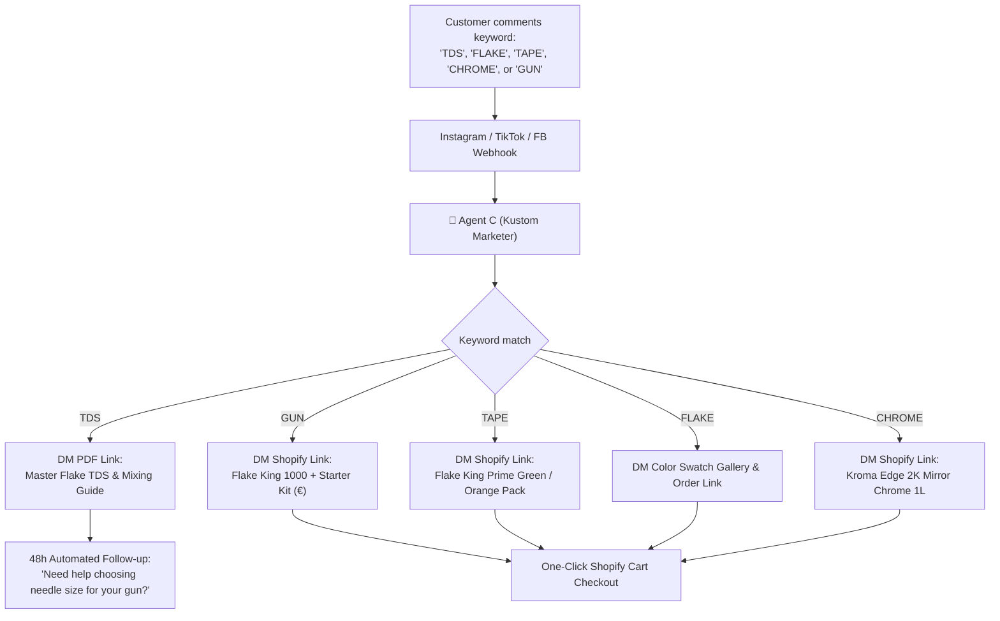

# Coast Airbrush Europe: Social Media Marketing & Retail Education Playbook
## High-Impact Video Scripts, Social Post Templates & DM Conversion Engine

> **Brand Identity:** Coast Airbrush Europe  
> **Target Audience:** Custom painters, automotive refinishers, airbrush artists, motorcycle/helmet builders, hobbyists, and retail customers across the UK & Europe.  
> **Core Objective:** Educate customers on proper product application (eliminating fear/mistakes) while driving direct pre-paid sales of **Flake King Guns & Flakes** and **KromaEdge Masking Tapes**.

---

## 🎬 Section 1: 5 Ready-to-Shoot Short-Form Video Scripts (30–60 Seconds)
*Optimized for Instagram Reels, TikTok, and YouTube Shorts. Format: 9:16 vertical video.*

---

### 🎥 Script 1: "The Old Way vs. The Flake King Way"
* **Goal:** High-contrast problem vs. solution hook. Stop the scroll by showing how traditional flake spraying ruins spray guns and wastes hours.
* **Featured Product:** Flake King 1000 Dry Metal Flake Gun & Flake King Polyester Flake.
* **Audio Track:** Fast-paced hip-hop/rock beat or trending suspense sound.

| Scene & Timing | Visual Action (What to Shoot) | Voiceover / Spoken Script | On-Screen Caption Text |
| :--- | :--- | :--- | :--- |
| **0:00 - 0:04** (Hook) | **Close-up**: Painter looking frustrated, shaking a gummed-up £400 paint gun clogged with wet flake. Cut to text on screen. | "Stop putting metal flake directly into your clear coat and ruining your spray guns!" | ❌ Stop putting flake in your paint gun! |
| **0:04 - 0:12** (Problem) | Quick cuts: Heavy sagging clear coat on a test panel, chunky uneven flake clumps, solvent pops. | "Wet spraying flake means massive carrier clear waste, endless runs, and 3 full days of color sanding." | ⚠️ 3 days of sanding & clogged guns... |
| **0:12 - 0:28** (Solution) | **Smooth action shot**: Spray a wet coat of clear. Immediately bring in the **Flake King 1000 Dry Gun** at 10–12 inches. A brilliant, uniform mist of dry holographic flake embeds instantly into the wet clear. | "Here’s how the pros do it: The Flake King 1000 sprays dry flake straight into wet clear. Zero gun clogs, 70% less clear coat used, and perfectly flat, uniform coverage every time." | ✨ Flake King 1000: Dry application into wet clear |
| **0:28 - 0:38** (The Proof) | Macro camera panning across the glistening dry flake panel. Painter lightly brushes excess flake off unmasked areas with a dry soft brush. | "When it flashes off, excess dry flake just brushes right off. Your paint gun stays 100% clean." | 🧹 Excess flake brushes clean |
| **0:38 - 0:45** (Call to Action) | Painter points Flake King gun to camera; show boxed Flake King starter kit. | "Save hours on your next build. Grab your Flake King gun and European-certified flakes at CoastAirbrush.eu." | 🔗 Link in bio: coastairbrush.eu |

---

### 🎥 Script 2: "The #1 Rookie Mistake with Dry Flake Guns"
* **Goal:** Practical retail education that builds trust and prevents customer returns/frustration.
* **Featured Product:** Flake King 500 / 1000 & Air Regulator.
* **Audio Track:** Clean, upbeat lo-fi instrumental.

| Scene & Timing | Visual Action (What to Shoot) | Voiceover / Spoken Script | On-Screen Caption Text |
| :--- | :--- | :--- | :--- |
| **0:00 - 0:05** (Hook) | **Humorous/Dramatic clip**: Painter pulls the trigger at 40 PSI; flake explodes in a glitter bomb over the whole shop and the painter's face. | "Did you just buy a Flake King gun and turn your shop into a disco ball? Watch this." | 💥 Don't make this £50 mistake! |
| **0:05 - 0:15** (Diagnosis) | Close-up of air regulator dial dropping from 40 PSI down to 5–10 PSI. | "The number one mistake every beginner makes is cranking the air pressure way too high. A Flake King isn’t a standard spray gun—it’s an airflow venturi." | 📉 Dial it down to 5–10 PSI! |
| **0:15 - 0:30** (Instruction) | **Over-the-shoulder shot**: Clear coat applied. Painter holds the Flake King gun 12–15 inches away, gently rolling the trigger. Flake floats down like a soft cloud, embedding evenly. | "Set your regulator to just 5 to 10 PSI. Hold the nozzle 12 to 15 inches back. Let the flake drift into the wet clear like a dust cloud. You get complete, mirror coverage without dumping the jar." | 📐 Distance: 12-15 inches. Gentle rolling motion. |
| **0:30 - 0:45** (Call to Action) | Split-screen showing smooth, level panel. Painter gestures to the screen. | "Save this video for your next spray day, and comment 'TDS' below to get our free Flake King technical mixing guide." | 💬 Comment "TDS" for the free guide! |

---

### 🎥 Script 3: "Why Flake King Prime Green Tape Beats Everything Else"
* **Goal:** Highlight the unique selling points (USPs) of Flake King Fine Line Tape (translucency, flexibility, zero bleed).
* **Featured Product:** Flake King Prime Green & Prime Orange Fine Line PVC Tapes.
* **Audio Track:** Punchy, satisfying beat with subtle mechanical sound effects.

| Scene & Timing | Visual Action (What to Shoot) | Voiceover / Spoken Script | On-Screen Caption Text |
| :--- | :--- | :--- | :--- |
| **0:00 - 0:05** (Hook) | **Extreme close-up macro**: Painter pulls traditional blue/paper tape on a helmet; fuzzy edges and bleed underneath. Buzz sound effect. | "Tired of paint bleed ruining 10 hours of custom layout work? Here's the fix." | ❌ Bleed lines = wasted hours |
| **0:05 - 0:18** (Feature 1: Translucency) | Painter lays down **Flake King Prime Green 3mm tape**. You can clearly see pencil grid lines right through the translucent tape. | "First: Flake King Prime Green is ultra-translucent thermally stabilised PVC. You can see your layout guidelines directly through the tape, so your symmetry is 100% dead on." | 👁️ Translucent: See your grid guidelines |
| **0:18 - 0:30** (Feature 2: Tight Radii) | Painter effortlessly bends the tape around a tight compound curve on a motorcycle tank with zero wrinkling or edge-lift. | "Second: Look at this curve flexibility. It bends around tight compound radiuses without lifting or wrinkling at the edge." | 🔄 Stretches without lifting |
| **0:30 - 0:42** (The Reveal & CTA) | Painter pulls the tape after spraying a candy red over silver base. The line is razor-sharp. | "Third: Zero adhesive residue, razor-sharp edge definition. Available now in 1mm to 6mm widths at Coast Airbrush Europe." | 🎯 Razor sharp lines every time. |

---

### 🎥 Script 4: "Flake Sizing 101: Which Size Do You Actually Need?"
* **Goal:** High-value retail education guiding buying decisions between micro, standard, and monster flakes.
* **Featured Product:** Flake King Flake Range: Ultra Small (50µm), Medium (200µm), Monster (1025µm).
* **Audio Track:** Educational, rhythmic ambient track.

| Scene & Timing | Visual Action (What to Shoot) | Voiceover / Spoken Script | On-Screen Caption Text |
| :--- | :--- | :--- | :--- |
| **0:00 - 0:04** (Hook) | Painter holds 3 clear vials of metal flake up to sunlight: one ultra-fine shimmer, one standard sparkle, one massive hex flake. | "Which flake size should you choose for your custom paint job? Let's break it down." | 🔍 Flake Sizing Guide: 50µm to 1025µm |
| **0:04 - 0:14** (50µm Ultra Small) | Close-up spray-out panel of fine pearlescent shimmer. | "50 Micron (.002 inch) is ultra-small. It sprays through any standard airbrush (0.3mm nozzle) and gives a silky, subtle metallic flip." | 1️⃣ 50µm (.002"): Airbrush friendly, silky shimmer |
| **0:14 - 0:24** (200µm Medium) | Show helmet with classic 70s muscle car sparkle. | "200 Micron (.008 inch) is the industry standard. This is your classic 70s chopper and bass-boat sparkle. Sprayed dry with the Flake King 500 or 1000." | 2️⃣ 200µm (.008"): The classic chopper sparkle |
| **0:24 - 0:35** (625µm to 1025µm Monster) | Show a wild lowrider roof panel reflecting rainbow highlights. | "625 to 1025 Micron is maximum impact. If you wet-sprayed this, you’d need 6 coats of clear to bury it. Sprayed dry with Flake King, 2 wet coats of high-solids clear bury it completely." | 3️⃣ 1025µm (.040"): Monster Flake. Easily buried dry! |
| **0:35 - 0:45** (Call to Action) | Show full color chart and Coast Airbrush Europe website link. | "Full Technical Data Sheets and over 40 European stock colors at CoastAirbrush.eu." | 📦 Shop 40+ colors at coastairbrush.eu |

---

### 🎥 Script 5: "The Ultimate ASMR Tape Peel (Zero Bleed)"
* **Goal:** Maximum viral reach, satisfaction factor, and organic shares on TikTok & Instagram Reels.
* **Featured Product:** Flake King Prime Orange Fine Line Tape & UltiMask Crepe.
* **Audio Track:** **RAW AUDIO ONLY (ASMR)**. No background music. Crisp peeling sounds, shop ambiance, satisfying sound effects.

| Scene & Timing | Visual Action (What to Shoot) | On-Screen Caption Text / Sound Notes |
| :--- | :--- | :--- |
| **0:00 - 0:03** | **Slow-motion macro**: Finger lifts edge of Flake King Prime Orange tape on a candy-flaked motorcycle tank. | *(Crisp peeling sound)* "Satisfying Tape Peel 🤤" |
| **0:03 - 0:15** | Continuous, smooth peel pulling back at a 45-degree angle. Razor-crisp line revealed between deep candy apple red and silver flake graphics. | *(Loud, resonant adhesive peel sound)* "Flake King Prime Orange Fine Line" |
| **0:15 - 0:25** | Peeling second and third layers of masking, revealing a multi-layer pinstriped flame design. Zero tear, zero bleed. | *(Pure ASMR audio)* "No bleed. No glue residue." |
| **0:25 - 0:30** | Final beauty shot under sunlight/booth lighting showing mirror reflection across the edge. | "Flake King Masking Tapes. Available at CoastAirbrush.eu" |

---

## 📱 Section 2: 10 High-Converting Social Post Templates
*Copy-and-paste templates formatted with viral hooks, body copy, hashtags, and DM triggers for Instagram, Facebook, and LinkedIn.*

---

### Post 1: The Material Savings Breakdown (Educational / Cost)
* **Format:** Multi-Slide Carousel or Video
* **Headline/Hook:** "How spraying flake dry saves custom painters £250+ per motorcycle build 📉"
* **Caption Body:**
  Ever calculated how much clear coat and metal flake gets wasted when you mix them together in a paint cup?
  
  When you wet-spray flake:
  ❌ Half the flake stays stuck inside your mixing pot and gun fluid passages.
  ❌ You need 4 to 6 heavy coats of clear just to bury the rough texture.
  ❌ Increased risk of solvent pop, heavy sagging, and days of block sanding.
  
  The Flake King Dry Gun method changes the math:
  ✅ Flake is applied dry directly into a single tacky wet coat of 2K clear.
  ✅ Un-stuck dry flake brushes off and can be collected and reused.
  ✅ 2 coats of clear completely bury the job.
  ✅ Zero flake in your spray gun. Zero teardown cleaning.
  
  Swipe through to see the cost comparison chart ➡️
  
  Ready to upgrade your booth workflow? Link in bio to explore the Flake King range at Coast Airbrush Europe.
* **Hashtag Set:**
  `#FlakeKing #CoastAirbrushEurope #CustomPaintShop #CustomAutomotive #MetalFlake #AutoRefinishing #PaintHacks #LowriderPaint #MotorcycleCustom`
* **Comment Trigger:** *"Comment **SAVINGS** below and we’ll DM you the complete dry vs. wet calculation sheet."*

---

### Post 2: The Tape Pull Masterclass (Technique / Tutorial)
* **Format:** Reel or Step-by-Step Photo Carousel
* **Headline/Hook:** "Are you pulling your fine line tape at the wrong angle? 📐"
* **Caption Body:**
  There is nothing worse than masking for 6 hours, clearing, and having your tape tear your fresh candy edge.
  
  Here are 3 golden rules from the Coast Airbrush master painter team:
  
  1️⃣ **Wait for the Flash, Don't Wait for Full Cure:** Pull your fine line tape when the paint is tacky-dry to the touch—not wet, and not fully crosslinked hard.
  2️⃣ **The 45° Rule:** Never pull tape straight up at 90°. Always pull back flat against itself at an acute 45-degree angle. This acts like a razor blade, shearing the paint film cleanly.
  3️⃣ **Use Translucent PVC (Flake King Prime Green):** Paper masking crumbles and absorbs solvent. Flake King Prime Green PVC tape resists solvent attack and gives you a microscopic clean edge.
  
  Drop your masking questions below—our technical team is answering in the comments! 👇
* **Hashtag Set:**
  `#FlakeKing #PrimeGreen #MaskingTape #FineLineTape #Pinstriping #AirbrushArt #CustomGraphics #PaintTips #CarPainting #HelmetPaint`
* **Comment Trigger:** *"Comment **TAPE** and we'll send you our Flake King fine line sample roll guide!"*

---

### Post 3: Equipment Teardown — Inside the Flake King 1000
* **Format:** High-Res Product Photography / Exploded View
* **Headline/Hook:** "Why the Flake King 1000 has zero moving fluid parts (and why that matters) ⚙️"
* **Caption Body:**
  Standard paint guns rely on needle seats, fluid tips, and air caps. Run metal flake through that, and you get micro-abrasion, jamming, and eternal cleaning headaches.
  
  The Flake King 1000 dry gun works on pure venturi fluid dynamics:
  💨 Air passes over the patented flake tube, lifting dry flake particles into suspension.
  🎯 Only air and flake touch the barrel—no paint, no resin, no solvents.
  ⏱️ Setup time: 10 seconds. Cleanup time: 0 seconds. Just blow it off with shop air.
  
  Available with standard jars and mini-bottles for tight spot repairs or massive all-over lowrider roofs.
  
  Now shipping throughout the UK and EU with 0% duty customs clearance on wholesale orders.
* **Hashtag Set:**
  `#FlakeKing1000 #CustomPainter #ToolPorn #AirbrushTools #AutoBodyTools #PaintSprayer #MotorcyclePaint #UKCustomPaint`
* **Comment Trigger:** *"Comment **GUN** for direct product specs & European shipping rates."*

---

### Post 4: The Helmet Artist Feature (Social Proof / UGC)
* **Format:** Artist Spotlight Showcase / Reel
* **Headline/Hook:** "How @[FeaturedArtist] achieved this insane holographic flake fade 🔥"
* **Caption Body:**
  Check out this custom helmet build by our community artist @[FeaturedArtist]! 
  
  Here's the technical stack behind this build:
  🎨 Basecoat: Jet Black base
  ✨ Flake: Flake King 200µm Holographic Silver applied dry with the Flake King 500
  📐 Masking: Flake King 3mm Prime Orange for the razor-sharp ribbon curves
  🍬 Topcoat: Triple-layer candy blue fade over 2K urethane clear
  
  Notice how clean the transition lines are between the heavy flake and the gloss candy? That’s what happens when you use solvent-resistant fine line tape that doesn't bleed.
  
  Want to be featured on Coast Airbrush Europe? Tag us in your build clips using #CoastAirbrushEurope!
* **Hashtag Set:**
  `#CustomHelmet #HelmetArt #FlakeKing #PrimeOrange #CustomPaint #AirbrushArtwork #BikerCulture #AraiHelmet #ShoeiCustom`
* **Comment Trigger:** *"Drop a 🔥 if you want a full video tutorial on this fade technique!"*

---

### Post 5: The "Dry vs. Wet" Flake Nozzle Matrix (Educational Cheat Sheet)
* **Format:** Technical Graphic / Infographic Carousel
* **Headline/Hook:** "Save this: The Master Flake Sizing & Nozzle Compatibility Chart 📊"
* **Caption Body:**
  Trying to spray .015" flake through a 1.2mm airbrush tip? You're going to have a bad day.
  
  Here is your quick-reference nozzle matrix:
  
  • **50 Micron (.002")**: Any airbrush or gun (0.3mm to 1.2mm)
  • **100 Micron (.004")**: Spray gun 1.2mm+ | Airbrush 0.5mm+
  • **200 Micron (.008")**: Spray gun 1.4mm+ (Airbrush dry ONLY via Flake King FOM500)
  • **375 Micron (.015")**: Spray gun 1.8mm+ (Dry gun recommended)
  • **625 Micron (.025")**: Spray gun 2.2mm+ (Dry gun strongly advised)
  • **1025 Micron (.040")**: Dry gun ONLY!
  
  Save this post so you have it ready in the mixing room. Bookmark it!
* **Hashtag Set:**
  `#PaintTech #TechnicalDataSheet #CustomPaintGuide #FlakeKing #SprayGunTips #BodyShopLife #AutoRefinish #CustomPainter`
* **Comment Trigger:** *"Comment **CHART** to get our high-resolution downloadable PDF version."*

---

### Post 6: The "Bleed Test" Challenge (Direct Comparison Video)
* **Format:** Side-by-side comparison video
* **Headline/Hook:** "Generic Hardware Tape vs. Flake King Prime Green: The Bleed Test 🧪"
* **Caption Body:**
  We put hardware store crepe paper tape side-by-side with Flake King Prime Green PVC tape under high-solvent Candy Koncentrate.
  
  The result?
  ❌ The standard tape soaked up the solvent, softened the basecoat, and left jagged bleed edges.
  ✅ Flake King Prime Green maintained a razor-sharp barrier with zero adhesive creep.
  
  If you're spending £100+ on premium custom paints, don't risk your finish with £2 masking tape.
  
  Equip your shop properly. Shop the full Flake King masking series at CoastAirbrush.eu.
* **Hashtag Set:**
  `#FlakeKing #PrimeGreen #MaskingTips #PaintBleed #CustomPaint #AirbrushSupplies #CustomGraphics #CoastAirbrush #PinstripeLife`
* **Comment Trigger:** *"Comment **TAPE** for our fine-line sample kit link."*

---

### Post 7: Guitar / Instrument Refinisher Spotlight (Niche Retail Education)
* **Format:** Video or Carousel showing electric guitar build
* **Headline/Hook:** "How luthiers and guitar customizers use dry metal flake 🎸✨"
* **Caption Body:**
  Custom guitars demand an ultra-thin finish to preserve resonance and sustain. Thick, heavy clear coats kill tone.
  
  That’s why boutique guitar builders across the UK and Europe are switching to the Flake King dry application system:
  1. No heavy slurry coats of clear needed to suspend the flake.
  2. The flake embeds flat into the wet binder.
  3. Total build thickness is reduced by over 40%, saving weight and curing time.
  
  From sparkle Telecasters to psychedelic bass guitars, get that California custom look right here in Europe.
* **Hashtag Set:**
  `#GuitarRefinishing #CustomGuitar #SparkleFinish #LuthierTools #GuitarBuilder #FlakeKing #CoastAirbrushEurope #ToneWood`
* **Comment Trigger:** *"Tag a luthier who needs to see this! 👇"*

---

### Post 8: The "What PSI?" Quick Tip (Micro-Lesson)
* **Format:** 15-Second Quick Reel / Short
* **Headline/Hook:** "The biggest lie in metal flake spraying: 'You need 40 PSI' 🛑"
* **Caption Body:**
  Higher air pressure does NOT mean better flake coverage!
  
  In fact, high pressure creates turbulent bounce-back that blows your flake right out of the wet clear coat and into the air booth filters.
  
  For Flake King Dry Guns:
  💨 Dial your regulator between **5 and 10 PSI**.
  💨 You want a gentle, floating mist that settles into the wet resin.
  💨 Let gravity and low velocity do the work.
  
  Double tap if you learned something new today! ❤️
* **Hashtag Set:**
  `#FlakeKing #PaintHacks #BodyShopHacks #CustomPainters #AirbrushTechnique #AutomotiveRefinish #CoastAirbrush`
* **Comment Trigger:** *"What PSI are you spraying at? Let us know in the comments below!"*

---

### Post 9: European Shipping & Customs Transparency (Trust & B2B/Retail)
* **Format:** Clean graphic showing UK & European logistics map
* **Headline/Hook:** "European Custom Painters: Say goodbye to US import duty headaches 🇪🇺🇬🇧"
* **Caption Body:**
  For years, getting authentic California custom paint gear and Flake King tools meant expensive US shipping, surprise import tariffs, and weeks in customs clearance.
  
  Not anymore.
  
  Coast Airbrush Europe provides:
  📦 Direct shipping across all 27 EU Member States in EUR (€) with OSS VAT compliance.
  🇬🇧 Fast domestic UK dispatch in GBP (£).
  0️⃣ 0% Preferential Duty rates through direct manufacturer supply chains.
  ⚡ In-stock inventory ready to ship immediately from our European fulfillment hubs.
  
  No surprise fees at your door. Just pure kustom culture delivered fast.
* **Hashtag Set:**
  `#CoastAirbrushEurope #EuropeanPainters #CustomPaintEU #UKCustomScene #PaintSupplies #AutoRefinishEurope #AirbrushEU`
* **Comment Trigger:** *"Comment your country below and we'll tell you your exact delivery transit time!"*

---

### Post 10: "Rate This Tape Peel 1-10" (High-Engagement Algorithm Booster)
* **Format:** Short ASMR Reel
* **Headline/Hook:** "Rate this tape peel from 1 to 10 🔥👇"
* **Caption Body:**
  There is nothing in custom painting as therapeutic as the final reveal.
  
  Product used: Flake King Prime Orange 6mm on a chopped Harley tank.
  
  Sound up for the peel! 🎧
  
  Drop your rating in the comments: 1 (disaster) to 10 (perfection)!
* **Hashtag Set:**
  `#TapePeel #SatisfyingVideos #ASMR #CustomHarley #FlakeKing #PrimeOrange #PaintPorn #CustomPaintWork #CoastAirbrush`
* **Comment Trigger:** *"Rate this peel 1–10 in the comments!"*

---

## 🤖 Section 3: Agent C ("The Kustom Marketer") DM Automation Triggers
*Automated DM flows to connect social comments directly to sales on Shopify Plus.*

### Automation Scripts:
1. **Keyword: `TDS`**
   * *DM Message:* "Hey [Name]! Here is your direct link to the official Flake King Metal Flake Technical Data Sheet & Mixing Guide: [Download Link]. It covers all nozzle sizes from 50µm up to 1025µm. Let us know what project you're spraying next!"
2. **Keyword: `GUN`**
   * *DM Message:* "Hey [Name]! Here is the Flake King 1000 Dry Gun ready to ship with zero import duty across UK & Europe: [Shopify Product Link]. It comes with standard jars and full technical support from our master painters."
3. **Keyword: `TAPE`**
   * *DM Message:* "Here is the link to our Flake King High-Precision Fine Line Masking bundle: [Shopify Product Link]. Includes 1mm, 2mm, 3mm, and 6mm widths of Prime Green & Orange for razor-sharp curves and zero solvent bleed!"
4. **Keyword: `CHROME`**
   * *DM Message:* "Here is the direct link to the Kroma Edge 2K Sprayable Mirror Chrome system from Show Up Japan: [Shopify Product Link]. Self-Organization Technology that stays clear under topcoat clear!"

---

## 📅 Section 4: Recommended 14-Day Launch Posting Schedule

| Day | Platform | Content Type | Content Title / Focus | Goal |
| :--- | :--- | :--- | :--- | :--- |
| **Day 1** | IG Reels / TikTok | Video (Script 1) | The Old Way vs. The Flake King Way | Problem/Solution Viral Hook |
| **Day 2** | IG / FB / LinkedIn | Carousel (Post 1) | How Dry Flake Saves £250+ Per Job | B2B / Pro Shop Value |
| **Day 3** | YouTube Shorts | Video (Script 2) | #1 Rookie Mistake with Dry Flake (PSI) | Technical Education |
| **Day 4** | IG / FB | Single Image (Post 3)| Inside the Flake King 1000 Hardware | Product Quality / Authority |
| **Day 5** | IG Reels / TikTok | Video (Script 5) | ASMR Tape Peel (Flake King Prime Orange) | Viral Reach & Engagement |
| **Day 6** | IG / FB | Carousel (Post 5) | Flake Sizing & Nozzle Compatibility Matrix | Saves / Bookmarks |
| **Day 7** | IG Stories | Community Q&A | "Ask a Master Painter Anything About Flake & Tape" | Engagement & FAQ building |
| **Day 8** | IG Reels / TikTok | Video (Script 3) | Why Flake King Prime Green Beats Everything | Product Differentiation |
| **Day 9** | IG / FB | Carousel (Post 6) | Generic Tape vs. Flake King Prime Green Bleed Test | Overcoming Objections |
| **Day 10** | YouTube Shorts | Video (Script 4) | Flake Sizing 101: Which Size Do You Need? | Retail Buying Guide |
| **Day 11** | IG Reels / TikTok | Video (Script 6) | The Liquid Mirror Miracle (Kroma Edge Chrome) | Shock & Awe Viral Reach |
| **Day 12** | IG Reels / TikTok | Short Reel (Post 8) | The Biggest Lie: "You Need 40 PSI" | Quick Tips / Authority |
| **Day 13** | IG / FB | Graphic (Post 9) | European 0% Duty Shipping Announcement | Trust & Conversion |
| **Day 14** | IG Reels / TikTok | Video (Post 10) | Rate This Tape Peel 1-10 | Maximum Viral Engagement |

---

## 🌟 Section 5: Curated Community UGC, Influencer Videos & Testimonial Directory

Use these verified community creators, YouTube channels, and real-world testimonials to curate user-generated content (UGC), tag artists, and license clips for your official Coast Airbrush Europe channels and on-site video showcase:

### 1. Dred fx Custom Paint (YouTube & Instagram)
* **Channel / Handle:** Dred fx Custom Paint
* **Key Content:** *"FLAKE KING PRO SET FULL REVIEW"* & *"Lowrider Flake and Lace Custom Paint Walkthrough"*
* **Core Takeaways & Positive Quotes:**
  > *"The Flake King system completely eliminates the anxiety of spraying heavy flake. You don't get any of that flurry or clumping you get when you try to mix it in clear. The control over complex panel work and lace effects is on another level."*
* **Best Clip to Repost:** Macro shot of dry holographic flake floating onto a candy panel and laying 100% flat.

### 2. Tony's Refinishing (YouTube)
* **Channel / Handle:** Tony's Refinishing
* **Key Content:** *"How To Spray Metal Flake Using The Flake King 1000 Dry Metal Flake Spray Gun"*
* **Core Takeaways & Positive Quotes:**
  > *"If you're still mixing flake into your clear coat, you're wasting time and wasting clear coat. With the Flake King 1000, your gun doesn't get contaminated, and you save gallons of expensive 2K clear. Clean up takes literally 10 seconds with shop air."*
* **Best Clip to Repost:** Side-by-side comparison of clear coat usage (wet flake vs. Flake King dry application).

### 3. SM Designs Airbrush (YouTube & Facebook)
* **Channel / Handle:** SM Designs Airbrush
* **Key Content:** *"Flake King 500 Dry Flake Airbrush Adapter Tutorial"*
* **Core Takeaways & Positive Quotes:**
  > *"The FK500 lets you adapt standard airbrushes to spray heavy flake for helmets, guitars, and fine details. It prevents the needle seat from getting wrecked by hard polyester edges."*
* **Best Clip to Repost:** Adapting the FK500 onto an Iwata airbrush and spraying a custom helmet profile.

### 4. Signal Inc. / SHOW UP Division (Official Japan Manufacturer)
* **Channel / Handle:** SHOW UP Official / Signal Inc.
* **Key Content:** *"KROMA EDGE Tech Video: Self-Organization Mirror Chrome"*
* **Core Takeaways & Positive Quotes:**
  > *"Kroma Edge uses proprietary Self-Organization Technology where metallic nanoparticles rise to the surface to form a continuous mirror film. Unlike traditional chrome paints that cloud up or turn grey when clear is applied, Kroma Edge is fully engineered to STAY CLEAR under 2K Topcoat Clear."*
* **Best Clip to Repost:** Time-lapse of cloudy wet paint magically aligning into a crystal mirror reflection over 60 seconds.

### 5. Coast Airbrush Community Testimonials
* **B2B Custom Shop Owner (UK):**
  > *"Swapping to the Flake King 1000 cut our Harley tank jobs from 4 days to less than 2 days. No more continuous block sanding between coats of clear just to knock down protruding flake spikes."*
* **Helmet Graphics Artist (Germany):**
  > *"Flake King Prime Green is the only tape I trust over fresh candy. You can see your grid marks through it, it turns 90-degree corners without puckering, and there is zero adhesive residue left behind."*

---

## 🎥 Bonus Script 6: "The Liquid Mirror Miracle (Kroma Edge 2K Chrome)"
* **Goal:** High-shock viral hook demonstrating Kroma Edge Self-Organization Technology.
* **Featured Product:** Kroma Edge 2K Sprayable Mirror Chrome System.
* **Audio Track:** Suspenseful bass swell leading to satisfying drop.

| Scene & Timing | Visual Action (What to Shoot) | Voiceover / Spoken Script | On-Screen Caption Text |
| :--- | :--- | :--- | :--- |
| **0:00 - 0:04** (Hook) | Painter holds up a motorcycle mirror housing reflecting the camera in 100% crisp chrome. | "This isn't electroplated metal. This was sprayed with a paint gun 20 minutes ago." | 🪞 Not chrome plating... SPRAY PAINT! |
| **0:04 - 0:15** (The Magic) | Macro time-lapse of Kroma Edge freshly sprayed: it goes on wet and cloudy, then over 45 seconds the metallic particles rise and align into liquid glass. | "This is Kroma Edge 2K from Show Up Japan. It uses Self-Organization Technology where metallic mirror seeds rise to the surface as it flashes off." | 🧪 Self-Organization Technology in real time |
| **0:15 - 0:28** (The Big Breakthrough) | Painter sprays 2K Topcoat Clear directly over the chrome panel. In split screen, traditional 1K chrome turns grey/milky, while Kroma Edge stays mirror-sharp. | "Here’s the game changer: traditional chrome paint turns grey as soon as you clear coat it. Kroma Edge cures with a hardener and STAYS 100% CLEAR under 2K urethane topcoat." | 🛡️ STAYS CLEAR under Topcoat Clear! |
| **0:28 - 0:40** (Call to Action) | Show boxed 1L and 420g Kroma Edge Kits with fast dispatch sticker. | "No electroplating tank required. In stock across UK & Europe at CoastAirbrush.eu." | 🚀 Shop Kroma Edge at coastairbrush.eu |
