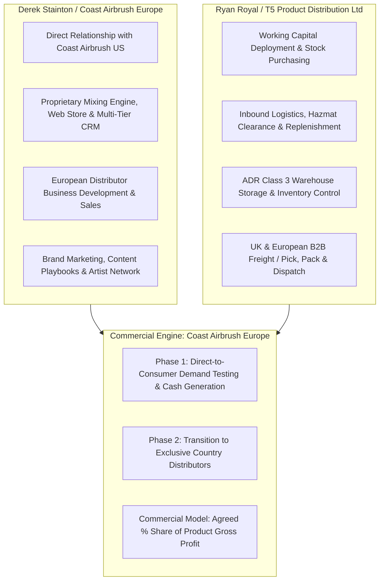
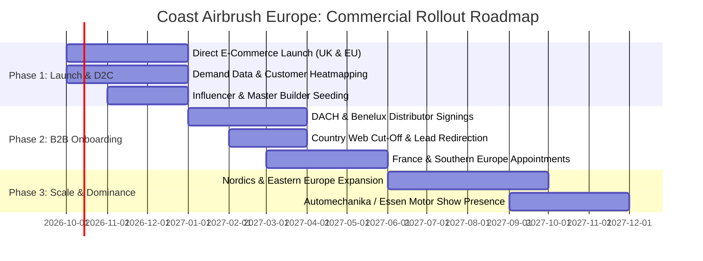

# Strategic Partnership Proposal & Commercial Term Sheet
## Coast Airbrush Europe & T5 Product Distribution Ltd
**Document Purpose:** Boardroom Discussion, Market Strategy, Competitor Intelligence & Terms Agreement  
**Principals:** Ryan Royal (Managing Director, T5 Product Distribution Ltd) & Derek Stainton (Director, Coast Airbrush Europe)  
**Date:** Autumn 2026  
**Status:** Confidential — Commercial-in-Confidence  

---

```
  ========================================================================================
  |                               COAST AIRBRUSH EUROPE                                  |
  |                Exclusive European Hub for Custom Automotive Paint                    |
  |                                         &                                            |
  |                          T5 PRODUCT DISTRIBUTION LTD                                 |
  |                      Logistics, Import & Fulfillment Partner                         |
  ========================================================================================
```

---

## Executive Summary & Strategic Rationale

### 1. The Market Opportunity
Custom automotive finishes, motorcycle customization, helmet artistry, and bespoke airbrushing represent a high-margin, resilient sector within the broader European automotive refinish market (€4.2B+). However, following Brexit and widespread European supply chain shifts, the European and UK custom paint market is plagued by:
1. **Severe product fragmentation**: Painters and jobbers are forced to piece together primers, custom candies, flakes, and reducers from multiple erratic suppliers.
2. **Post-Brexit import friction and hazmat freight penalties**: Importing solvent paints individually from the US or UK across borders incurs crushing carrier dangerous goods (UN1263 Class 3) surcharges (€45–€95 per parcel) and customs delays.
3. **Outdated distribution paradigms**: Incumbents lack modern digital mixing engines, live formula calculators, and automated e-commerce replenishment tools.

### 2. The Strategic Alliance
This proposal outlines a symbiotic joint venture structure between **Derek Stainton** (operating Coast Airbrush Europe) and **T5 Product Distribution Ltd** (led by Managing Director **Ryan Royal**):



### 3. The Core Commercial Mechanism: "Demand Validation to Territory Lockdown"
The defining commercial feature of this partnership solves the single greatest barrier in automotive paint distribution: **Distributor Channel Conflict**.

* **Phase 1 (D2C Demand Proving)**: End users across the UK and Continental Europe purchase directly through `coastairbrush.eu`. This establishes initial revenue, proves regional demand, tests SKU velocity, and captures valuable customer data.
* **Phase 2 (Country Distributor Appointment & Web Cut-Off)**: The moment an exclusive distributor is appointed in a specific European country (e.g., Germany, France, Spain, Italy, Sweden), **direct B2C website purchasing is immediately disabled for that country**.
* **Zero Channel Conflict**: 100% of website traffic, customer inquiries, and jobber leads for that territory are geo-routed exclusively to the local appointed distributor. This guarantees the distributor a protected, captive market with pre-existing demand, making the Coast Airbrush distribution license an irresistible commercial proposition.

---

## UK & European Competitor Analysis

A comprehensive audit of custom paint manufacturers, specialized coating brands, and distribution jobbers across the UK and Continental Europe.

```
┌─────────────────────────────────────────────────────────────────────────────────────────────────┐
│                               EUROPEAN CUSTOM PAINT COMPETITIVE LANDSCAPE                       │
├───────────────────────────────┬─────────────────────────────────┬───────────────────────────────┤
│    TRADITIONAL HERITAGE       │       SPECIALIST FACTORY        │       WATER-BASED / AIRBRUSH  │
│    - House of Kolor (US/UK)   │       - Custom Creative (Spain) │       - Createx Colors (DE)   │
│    - DNA Custom Paints (AU)   │       - Specialist Paints (UK)  │       - Wicked Colors (US/EU) │
│    - Mipa VIP (Germany)       │       - Stardust Colors (FR)    │       - Vallejo Premium (ES)  │
└───────────────────────────────┴─────────────────────────────────┴───────────────────────────────┘
```

### 1. House of Kolor (Valspar / Sherwin-Williams Automotive)
* **Profile**: The historic pioneer of custom automotive paint (founded by Jon Kosmoski in 1956). Acquired by Valspar, now part of Sherwin-Williams.
* **UK / European Distribution Model**: Distributed in the UK via regional factors and retail jobbers (e.g., Jawel Paints, Autopaint Solutions, Martin Brown Paints). In Europe, availability is highly fractured, reliant on legacy refinish jobbers.
* **Product Strengths**: World-renowned brand recognition; high pigment loading; Shimrin2 basecoat system; legendary Kandys (KK, UK, KBC).
* **Vulnerabilities & Market Gaps**:
  * **Corporate Neglect**: Viewed as a tiny niche within Sherwin-Williams’ multi-billion industrial refinish business; low product innovation and virtually zero dedicated digital marketing in Europe.
  * **Regulatory Friction**: Stringent EU and UK VOC limits have led to confusion over solvent compliance for solvent basecoats vs. water-borne refinish rules.
  * **Pricing & Availability**: Extreme cost inflation per quart/gallon; frequent stockouts at UK factors; slow shipment lead times from North America.
  * **No Modern Digital Support**: No integrated mixing engine app or digital formula calculator for custom builders.

### 2. Custom Creative (Spain / Pan-European)
* **Profile**: Spain-based specialized custom paint manufacturer with deep European footprint in automotive, bike, and custom artistic finishes.
* **Distribution Model**: Sells directly and through regional paint distributors across Spain, France, Italy, and Germany. Distributed in the UK via specialized online paint factors (e.g., Colourfox, Spraygunner).
* **Product Strengths**: Excellent candy concentrates, metallic basecoats, high-solids clearcoats, and flake systems; compliant with European chemical standards; competitive manufacturing pricing within the EU.
* **Vulnerabilities & Market Gaps**:
  * **Brand Cachet**: Lacks the iconic 40-year American hot-rod and West Coast custom heritage of Coast Airbrush.
  * **UK Foothold**: Weak direct presence in the UK following Brexit border friction; reliant on 3rd-party stockists who carry incomplete SKU ranges.
  * **Channel Conflict**: Sells direct to consumers online while attempting to sign regional dealers, causing margin friction with brick-and-mortar jobbers.

### 3. Specialist Paints / Custom Paints Ltd (UK)
* **Profile**: UK-based manufacturer and distributor operating the "Inspire Paints" line.
* **Distribution Model**: Primarily Direct-to-Consumer (D2C) and direct-to-shop via their e-commerce storefront (`specialistpaints.com`), with international courier export.
* **Product Strengths**: Broad range of special-effect coatings (pearls, candies, thermochromic, hydrographic, chrome effects, metal flakes); based in St Helens, UK.
* **Vulnerabilities & Market Gaps**:
  * **Lack of Premium Distributor Network**: Over-reliance on direct online sales alienates professional trade refinish distributors and factors who want exclusive territory protection.
  * **Perception**: Viewed as a hobbyist/customizer supplier rather than an elite, OEM-level custom automotive paint brand.
  * **Post-Brexit Friction into Europe**: Shipping individual solvent cans into the EU incurs customs clearance delays, French/Dutch port inspections, and import VAT charges at the customer’s door.

### 4. Stardust Colors (France / Pan-European)
* **Profile**: Major French manufacturer and distributor founded in 2009 in Saint-Laurent-des-Arbres, France.
* **Distribution Model**: Giant multi-lingual e-commerce website shipping across Europe; also supplies industrial and body shop accounts.
* **Product Strengths**: Extensive catalog of effect pigments (crystalizer, chameleon, phosphorescent, chrome, holographic); strong logistics within Schengen.
* **Vulnerabilities & Market Gaps**:
  * **Pure E-Commerce Mindset**: Does not operate a true territory-protected distribution model.
  * **Brand Narrative**: Lacks authentic Kustom Kulture lifestyle identity; reads as an industrial chemical catalog rather than an aspirational lifestyle brand.
  * **Airbrush & Pinstriping Weakness**: Focuses heavily on raw chemical effects rather than integrated artist tools, striping lacquers, or precision airbrush hardware.

### 5. Createx Colors (Distributed via Createx Handels-GmbH, Germany)
* **Profile**: The dominant force in water-based airbrush colors (Wicked Colors, Auto Air legacy, candy2o, Illustration Colors).
* **Distribution Model**: Well-organized European master distributor (Createx Handels-GmbH) serving dedicated hobby and graphic art retailers across Europe.
* **Product Strengths**: Non-toxic, water-based formulations; zero VOC issues; high artist loyalty in fine art, RC cars, textiles, and taxidermy.
* **Vulnerabilities & Market Gaps**:
  * **Automotive Solvent Void**: Professional automotive customizers and chopper builders still demand high-solids solvent-borne urethanes, candies, and clearcoats for production speed, flow-out, and depth of gloss. Createx does not fulfill the true solvent automotive refinish demand.

### 6. Mipa AG (VIP Custom Line, Germany)
* **Profile**: German automotive refinish giant with a niche "Mipa VIP" custom effect color line.
* **Distribution Model**: Massive, entrenched European jobber distribution network.
* **Product Strengths**: Outstanding industrial quality, German DIN compliance, massive distribution footprint.
* **Vulnerabilities & Market Gaps**:
  * Custom paint is 0.5% of Mipa's business; their sales reps are focused on collision repair fleet contracts, not custom builders, flakes, or airbrush artists.

---

### Comparative Competitor Matrix

| Competitor | Origin | Primary Product Focus | EU / UK Distribution Strength | Digital Tools & Mixing Tech | Channel Protection for Jobbers | Brand Heritage & Cultural Pull |
| :--- | :--- | :--- | :--- | :--- | :--- | :--- |
| **House of Kolor** | USA | Solvent Automotive Custom Paint | Moderate (UK factors; fragmented in EU) | Low (Static PDF charts) | Low (Discounts eroded; fragmented supply) | ★★★★★ (Iconic, legendary) |
| **Custom Creative** | Spain | Custom Solvents, Candies, Flakes | Strong in Southern EU; Weak in UK | Moderate (Basic formulas online) | Moderate (Competes with direct site) | ★★★☆☆ (Solid European trade brand) |
| **Specialist Paints** | UK | Special Effect Paints (Inspire) | Strong UK D2C; Fragmented EU | Low (Standard e-commerce) | ❌ None (Direct-to-consumer model) | ★★☆☆☆ (Niche hobbyist/custom) |
| **Stardust Colors** | France | Special Effect & Optical Paints | Strong EU Direct Shipping; Weak UK | Moderate (Technical data sheets) | Low (Direct internet sales focus) | ★★☆☆☆ (Chemical specialist) |
| **Createx Colors** | USA/DE | Water-based Airbrush / Graphic Paint | High (Createx GmbH wholesale network) | Moderate (Color charts & guides) | ★★★★☆ (Strict dealer network) | ★★★★☆ (Airbrush industry standard) |
| **Coast Airbrush Europe (Our Platform)** | USA/JP/UK | Complete Custom Solvent & Kroma Edge System + Flake King | **High (Hybrid D2C to Protected Exclusive Distributors)** | **★★★★★ (Live Web Mixing Engine, AI Support, CRM)** | **★★★★★ (100% Territory Web Cut-Off Guarantee)** | **★★★★★ (World's #1 Custom Paint Destination)** |

---

## Strategic Moat & Coast Airbrush Value Proposition

```
                                  THE 4 PILLARS OF OUR UNFAIR ADVANTAGE
                                  
  ┌────────────────────────┐  ┌────────────────────────┐  ┌────────────────────────┐  ┌────────────────────────┐
  │   1. BRAND POWERHOUSE  │  │ 2. REVOLUTIONARY TECH  │  │  3. CHANNEL INTEGRITY  │  │ 4. LOGISTICS SYNERGY   │
  │ Coast Airbrush is the  │  │ Interactive Paint      │  │ Initial D2C validation │  │ T5's bonded & domestic │
  │ global home of kustom  │  │ Mixing Engine, AI Spec │  │ turns OFF for that     │  │ facilities eliminate   │
  │ culture, endorsed by   │  │ Agents, and Live CRM   │  │ country as soon as a   │  │ post-Brexit double-    │
  │ legendary builders.    │  │ for jobbers/painters.  │  │ distributor signs.     │  │ duty and hazmat fees.  │
  └────────────────────────┘  └────────────────────────┘  └────────────────────────┘  └────────────────────────┘
```

1. **Brand Authority**: Coast Airbrush (California) is universally recognized as the undisputed Mecca of custom paint, airbrushing, and hot-rod finishes. Launching the brand officially in Europe immediately attracts the top 10% of elite builders.
2. **Kroma Edge & Master System Exclusivity**: Access to cutting-edge solvent chemistries developed in partnership with Signal Japan and Show Up, offering unparalleled clarity in candies, raw pearl density, and ease of application.
3. **The Proprietary Digital Mixing Engine**: An interactive, browser-based formula calculator that calculates exact volume, mixing ratios (basecoat:reducer:hardener:flake), and layer-by-layer formulas. This software acts as an impenetrable competitive moat that binds painters and jobbers to our paint system.
4. **Distributor-First Loyalty**: By committing to **cut off direct online retail in any country with an active distributor**, we offer distributors an unprecedented, risk-free partnership that no competitor matches.

---

## Comprehensive Sales & Marketing Plan

### 1. Phased Go-to-Market Strategy



#### Phase 1: D2C Demand Generation & Market Mapping (Months 1–3)
* **Channel**: `coastairbrush.eu` central digital storefront, shipping from T5 facilities.
* **Geographic Coverage**: United Kingdom, Germany, France, Netherlands, Belgium, Italy, Spain, Scandinavia, Austria, Switzerland.
* **Strategic Objective**:
  * Generate immediate, high-margin cash flow to offset setup costs.
  * Prove product demand in specific regions (e.g., proving that €15,000/month of orders originate specifically from Bavaria/Baden-Württemberg or Northern France).
  * Build a qualified database of commercial body shops, motorcycle builders, and custom studios.

#### Phase 2: Distributor Recruitment & Frictionless Handover (Months 4–9)
* **The "Warm Demand" Pitch**: Rather than cold-calling distributors, Derek approaches the premier paint factors in each target country equipped with hard data:
  > *"We already have 140 active custom shops in your territory ordering €18,000/month of Coast Airbrush / Kroma Edge products through our website. We want to hand this entire customer base directly to you on an exclusive basis. As soon as you place your initial stocking order, we turn off direct purchasing for your country and route all traffic, orders, and inquiries directly to you."*
* **The Cut-Off Mechanism**:
  * When Germany signs, users visiting from German IP addresses or entering German shipping addresses receive an authorized redirect banner:  
    *“Coast Airbrush Germany is now officially powered by [Distributor Name]. Orders are dispatched locally with 24hr courier delivery and zero import customs fees. Click here to order through our German Master Distributor.”*
  * Direct B2C checkout for that territory is disabled, completely protecting the distributor’s margin.

#### Phase 3: Pan-European Maturity & Long-Term Contracts (Months 10+)
* Full network of 6–8 Regional Master Distributors covering the major European economic zones:
  1. **DACH Hub** (Germany, Austria, Switzerland)
  2. **Benelux Hub** (Netherlands, Belgium, Luxembourg)
  3. **Iberian Hub** (Spain, Portugal)
  4. **French Hub** (France)
  5. **Italian Hub** (Italy)
  6. **Nordic Hub** (Sweden, Norway, Denmark, Finland)
  7. **UK Domestic Hub** (Directly serviced by T5 Product Distribution)

---

### 2. Commercial Distributor Onboarding Terms

To ensure commitment and working capital velocity, distributors must meet structured qualification criteria:

```
┌─────────────────────────────────────────────────────────────────────────────────────────────────┐
│                               DISTRIBUTOR COMMERCIAL FRAMEWORK                                  │
├───────────────────────────────────┬─────────────────────────────────┬───────────────────────────┤
│ 1. INITIAL STOCKING ORDER (ISO)   │ 2. MINIMUM ANNUAL QUOTAS        │ 3. RETRO-REBATE TIERS     │
│ - Tier 1 (DE, FR, UK): €35k - €50k│ - €120k to €250k Annual Quota   │ - 3% at 100% of Quota     │
│ - Tier 2 (Benelux, ES, IT): €25k  │ - Monitored quarterly in CRM    │ - 5% at 120% of Quota     │
│ - Tier 3 (Nordics, AT): €15k      │ - Territory exclusivity gate    │ - 7.5% at 150% of Quota   │
└───────────────────────────────────┴─────────────────────────────────┴───────────────────────────┘
```

1. **Initial Stocking Order (ISO)**:
   * Mandatory initial buy-in covers core fast-moving inventory: Kroma Edge Candy Concentrates, Jet Black / Pure White basecoats, Medium/Slow Reducers, 2K Show Clearcoats, and a complete Flake King display.
   * Includes branded Point of Sale (POS) showroom stand, swatch decks, and counter promotional materials.
2. **Territorial Exclusivity & Performance Milestones**:
   * Exclusive rights granted for a 12-month rolling period.
   * Territory exclusivity is contingent on meeting agreed quarterly purchasing milestones (e.g., minimum 80% run-rate of target).
3. **Minimum Advertised Price (MAP) Policy**:
   * Strict European MAP agreement to prevent price-slashing across borders and preserve high gross margins for all authorized stockists.
4. **Volume Retro-Rebates**:
   * Incentivizes distributors to push volume: quarterly cash-back or credit notes disbursed upon exceeding annual target bands (3% at 100%, 5% at 120%, 7.5% at 150%).

---

### 3. Omnichannel Marketing Engine

```mermaid
flowchart LR
    subgraph Top_Of_Funnel["Awareness & Inspiration"]
        Instagram["Instagram Reels & TikTok\n(Candy spray-outs, flake reveals)"]
        YouTube["YouTube Masterclasses\n(Technical mixing & chopper builds)"]
        Influencer["Elite Builder Partnerships\n(Custom bike & hot-rod painters)"]
    end

    subgraph Mid_Of_Funnel["Education & Engagement"]
        MixingApp["Interactive Paint Mixing Engine\n(Color matching & ratio calculation)"]
        CRMLead["Automated CRM Technical Chatbot\n(Weather-based reducer guidance)"]
    end

    subgraph Bottom_Of_Funnel["Conversion & Reorder"]
        D2CStore["E-Commerce Checkout (Initial Phase)"]
        DistLocator["Local Exclusive Distributor Re-route (Phase 2)"]
        WholesalePortal["B2B Quick-Order Portal for Jobbers"]
    end

    Top_Of_Funnel --> Mid_Of_Funnel
    Mid_Of_Funnel --> Bottom_Of_Funnel
```



* **Elite Builder Ambassador Program**: Seed complete paint systems to 15 top custom motorcycle, hot-rod, and airbrush artists across the UK, Germany, France, and Spain. Video documentation of their custom paint jobs generates viral social proof.
* **Technical Video Playbook**: Short-form, high-impact video content focused on solving real painter pain points:
  * *"Why your candy coat is blotchy (and how Kroma Edge solves it)"*
  * *"How to spray dry flake without clogging your clearcoat"*
  * *"Step-by-step 3-stage pearl candy layout on a Harley-Davidson tank"*
* **Trade Show Presence**: High-visibility showcase booths at premier European events:
  * **Essen Motor Show (Germany)**: Europe’s largest custom car and tuning showcase.
  * **Automechanika Frankfurt**: B2B distributor networking and commercial jobber recruitment.
  * **Motorcycle Live / The MCN London Show (UK)**: Direct custom bike builder engagement.

---

## Operational Division of Responsibilities (RACI Matrix)

A clean division of responsibilities ensures zero operational friction:

```
  ┌────────────────────────────────────────────────────────────────────────────────────────┐
  │                                   RACI RESPONSIBILITY MATRIX                           │
  │   R = Responsible (Does work)  |  A = Accountable (Final say)                          │
  │   C = Consulted (Provides input)  |  I = Informed (Kept updated)                       │
  └────────────────────────────────────────────────────────────────────────────────────────┘
```

| Operational Area / Task | Derek Stainton (Coast Europe) | Ryan Royal / T5 Distribution | RACI Lead |
| :--- | :---: | :---: | :---: |
| **US Relationship & IP Governance (Coast USA)** | **Accountable / Responsible** | Consulted | **Derek** |
| **Product Selection, Color Formulations & Technical Specs** | **Accountable / Responsible** | Consulted | **Derek** |
| **Website, E-Commerce, UX, & Paint Mixing Software** | **Accountable / Responsible** | Informed | **Derek** |
| **European Distributor Sourcing, Pitching & Negotiation** | **Accountable / Responsible** | Consulted | **Derek** |
| **Brand Marketing, Social Media & Content Creation** | **Accountable / Responsible** | Informed | **Derek** |
| **Customer Support (Technical & Application Guidance)** | **Accountable / Responsible** | Informed | **Derek** |
| **Working Capital Deployment & Purchasing Financing** | Consulted | **Accountable / Responsible** | **Ryan / T5** |
| **Inbound Freight, Ocean Shipping & Customs Clearance** | Consulted | **Accountable / Responsible** | **Ryan / T5** |
| **Warehousing, ADR Hazmat Storage & Inventory Safety** | Informed | **Accountable / Responsible** | **Ryan / T5** |
| **Order Fulfillment (Pick, Pack, & Same-Day Dispatch)** | Informed | **Accountable / Responsible** | **Ryan / T5** |
| **B2B Pallet Freight to European Distributors** | Consulted | **Accountable / Responsible** | **Ryan / T5** |
| **Back-Office Invoicing, Credit Control & VAT Reporting** | Consulted | **Accountable / Responsible** | **Ryan / T5** |
| **Website Country Geo-Fencing & Cut-Off Execution** | **Accountable / Responsible** | Informed | **Derek** |

---

## Financial Architecture & Commercial Term Sheet

### 1. Supply Chain Landed Cost & Profit Margin Analysis

By utilizing direct ocean shipments from Signal Japan for core basecoats and bulk replenishment via Coast USA, the business achieves industry-leading margins:

```
┌─────────────────────────────────────────────────────────────────────────────────────────────────┐
│                               UNIT ECONOMICS: KROMA EDGE CUSTOM PAINT KIT                       │
├───────────────────────────────────────────────────┬─────────────────────────────────────────────┤
│ Component                                         │ Cost / Value (EUR €)                        │
├───────────────────────────────────────────────────┼─────────────────────────────────────────────┤
│ 1. Supplier Base FOB Price (Japan / US)           │ €32.20                                      │
│ 2. Inbound Ocean Freight Allocation (Per Unit)    │ €3.00                                       │
│ 3. Hazmat / ADR Compliance Allocation             │ €1.50                                       │
│ 4. Customs Brokerage & Entry Clearance            │ €0.50                                       │
│ 5. Customs Duty (0% under Japan REX EPA)          │ €0.00                                       │
├───────────────────────────────────────────────────┼─────────────────────────────────────────────┤
│ TOTAL TRUE LANDED COST OF GOODS (COGS)            │ €37.20                                      │
├───────────────────────────────────────────────────┼─────────────────────────────────────────────┤
│ A. B2C Direct Retail Price (excl. VAT)            │ €119.95                                     │
│    -> Gross Profit per Unit (D2C)                 │ €82.75                                      │
│    -> GROSS MARGIN % (D2C)                        │ 68.99%                                      │
├───────────────────────────────────────────────────┼─────────────────────────────────────────────┤
│ B. B2B Wholesale Distributor Price (excl. VAT)    │ €74.50 (38% discount off MSRP)              │
│    -> Gross Profit per Unit (Distributor)         │ €37.30                                      │
│    -> GROSS MARGIN % (B2B Distributor)            │ 50.07%                                      │
└───────────────────────────────────────────────────┴─────────────────────────────────────────────┘
```

---

### 2. Commercial Profit-Sharing Mechanism

#### Precise Definition of Gross Profit:
To eliminate ambiguity during month-end settlements, **Product Gross Profit** is defined with mathematical precision:

$$\text{Gross Profit} = \text{Net Invoiced Product Sales} - \text{True Landed Cost of Goods Sold (COGS)}$$

Where:
* **Net Invoiced Product Sales** = Gross sales revenue collected from direct website sales and wholesale distributor invoices, net of value-added tax (VAT), legitimate trade discounts, and refunded returns.
* **True Landed COGS** = Manufacturer FOB product purchase price + direct inbound freight + customs brokerage fees + non-recoverable import duties + dangerous goods inbound handling.
* *Note: General corporate overheads, central office leases, or unrelated administrative costs are NOT deducted from the Gross Profit calculation.*

#### Proposed Remuneration Models for Derek Stainton:
During the table discussion between Derek Stainton and Ryan Royal, three standard partnership models can be evaluated:

```
┌─────────────────────────────────────────────────────────────────────────────────────────────────┐
│                               PROFIT SHARING REMUNERATION OPTIONS                               │
├───────────────────────────────────┬─────────────────────────────────┬───────────────────────────┤
│ MODEL A: BALANCED PROFIT SPLIT    │ MODEL B: TIERED SCALE-UP SPLIT  │ MODEL C: GROSS MARGIN OVERRIDE
│ (Recommended)                     │                                 │                           │
│ - 30% to 35% of Gross Profit to   │ - 30% of GP on first €500k sales│ - Fixed 15% to 18% of Net 
│   Derek Stainton.                 │ - 35% of GP between €500k-€1M   │   Invoiced Sales Revenue. 
│ - 65% to 70% to T5 (covers capital│ - 40% of GP above €1M           │ - Zero accounting dispute;
│   cost, warehousing & pick/pack). │ - Rewards volume growth.        │   simple topline tracking.
└───────────────────────────────────┴─────────────────────────────────┴───────────────────────────┘
```

* **Recommended Deal Structure (Model A / Balanced)**:
  * **Derek Stainton Receives**: **30% to 35% of Total Product Gross Profit** across all sales channels (both initial D2C web sales and recurring B2B European distributor sales).
  * **T5 Product Distribution Retains**: **65% to 70% of Product Gross Profit**, compensating T5 for deploying working capital, inventory holding risk, warehousing space, pick/pack labor, and administrative credit control.

#### Accounting & Settlement Terms:
* **Reporting Cycle**: T5 provides an automated monthly Gross Margin & Sales Ledger within 10 business days following the close of each calendar month.
* **Remittance**: Derek's profit share fee is remitted via bank transfer on or before the 15th day of the following calendar month (Net 15 days from month-end).
* **Open-Book Transparency**: Mutual access to the unified Shopify/Katana/ERP ledger tracking live inventory, cost prices, order volumes, and distributor invoices.

---

### 3. Projected 24-Month Financial Trajectory

Assuming conservative distributor onboarding pacing (2 distributors onboarded per quarter from Month 4 onwards):

```
┌─────────────────────────────────────────────────────────────────────────────────────────────────┐
│                                24-MONTH CONSERVATIVE FINANCIAL FORECAST                         │
├───────────────────────────────┬───────────────────────────────┬─────────────────────────────────┤
│ Financial Metric              │ Year 1 (Launch & Foundation)  │ Year 2 (Network Expansion)      │
├───────────────────────────────┼───────────────────────────────┼─────────────────────────────────┤
│ Direct D2C Web Sales (ex VAT) │ €180,000                      │ €90,000 (Transitioned to B2B)   │
│ B2B Distributor Sales (ex VAT)│ €320,000 (3 Distributors)     │ €980,000 (7 Distributors)       │
├───────────────────────────────┼───────────────────────────────┼─────────────────────────────────┤
│ TOTAL GROSS REVENUE           │ €500,000                      │ €1,070,000                      │
│ Blended Gross Margin (%)      │ 56.8%                         │ 51.6%                           │
│ TOTAL GROSS PROFIT POOL       │ €284,000                      │ €552,120                        │
├───────────────────────────────┼───────────────────────────────┼─────────────────────────────────┤
│ Derek Stainton Share (35%)    │ €99,400                       │ €193,242                        │
│ T5 Distribution Share (65%)   │ €184,600                      │ €358,878                        │
└───────────────────────────────┴───────────────────────────────┴─────────────────────────────────┘
```

---

## Regulatory, Hazmat & Logistics Strategy

Post-Brexit regulations and EU chemical directives require strict compliance to avoid customs seizures and border delays:

```
                               ┌──────────────────────────────────────────┐
                               │       CROSS-BORDER COMPLIANCE ENGINE     │
                               └────────────────────┬─────────────────────┘
                                                    │
            ┌───────────────────────────────────────┴───────────────────────────────────────┐
            ▼                                                                               ▼
┌───────────────────────────────────────┐                       ┌───────────────────────────────────────┐
│         UK DOMESTIC COMPLIANCE        │                       │       CONTINENTAL EU COMPLIANCE       │
│ - GB CLP & UK REACH alignment         │                       │ - EU REACH Annex XVII VOC conformity  │
│ - UN1263 Class 3 Flammable Liquid     │                       │ - ADR Limited Quantity (LQ) Ground    │
│ - UK Postponed VAT Accounting (PVA)   │                       │ - Multi-lingual SDS (DE, FR, ES, IT)  │
│ - 24hr Mainland Ground Courier        │                       │ - EU One Stop Shop (OSS) for D2C      │
└───────────────────────────────────────┘                       └───────────────────────────────────────┘
```

1. **Dangerous Goods (UN1263 Class 3 Flammable Liquids)**:
   * Solvent basecoats, reducers, and clearcoats fall under UN1263 Class 3.
   * **ADR Limited Quantity (LQ) Exemption**: By packaging paints in containers $\le 5\text{L}$ within outer combination packaging $\le 30\text{kg}$, shipments qualify for the ADR LQ road exemption across both the UK and Europe. This **completely eliminates expensive carrier Hazmat surcharges** on standard parcel deliveries.
2. **Postponed VAT Accounting (PVA)**:
   * T5 utilizes UK Postponed VAT Accounting on bulk imports, eliminating upfront cash VAT payments at the border and protecting working capital cash flow.
3. **Safety Data Sheets (SDS) & CLP Labeling**:
   * All products supplied with localized CLP hazard pictograms and multi-lingual SDS in English, German, French, and Spanish, managed centrally through the online digital hub.

---

## Roundtable Discussion Agenda & Term Sheet Agreement

When Derek Stainton and Ryan Royal sit down to finalize terms, the discussion should center on approving this four-part Term Sheet:

### 1. Partnership Scope & Exclusivity
* Coast Airbrush Europe grants T5 Product Distribution Ltd **exclusive rights** as the primary UK and European warehousing, logistics, and replenishment partner.
* T5 agrees that Derek Stainton maintains exclusive operational control over the Coast Airbrush US relationship, brand marketing, e-commerce assets, and European distributor appointments.

### 2. Commercial Split & Terms
* **Remuneration**: Derek Stainton receives **35% of Gross Profit** generated from all Coast Airbrush product sales (D2C and B2B).
* **Payment Schedule**: Remitted monthly, on or before the 15th of the following month (Net 15 days).
* **Initial Capital Allocation**: T5 commits an agreed initial working capital line (e.g., £50,000–£75,000) for the initial inventory replenishment order covering high-velocity Kroma Edge, Show Up, and Flake King SKUs.

### 3. The Country Cut-Off Rule (Contractual Commitment)
* Both parties contractually ratify the distribution protection clause:  
  *Upon the execution of a Master Distributor Agreement in any country and receipt of the Initial Stocking Order, central website B2C purchasing for that country will be turned off within 5 business days, and all local web inquiries will be redirected to the distributor.*

### 4. Immediate Next Steps & Launch Checklist (30-Day Execution)
1. **Week 1**: Sign Letter of Intent (LOI) / Operating Partnership Agreement based on this term sheet.
2. **Week 2**: Finalize SKU list and issue purchase order to Coast Airbrush US / Signal Japan for initial stock replenishment.
3. **Week 3**: Configure T5 inventory management (WMS) with Shopify API and setup shipping profiles.
4. **Week 4**: Public announcement of Coast Airbrush Europe launch; initiate Phase 1 D2C marketing and distributor outreach.

---
*Signed in agreement in principle:*

\
___________________________________________  
**Ryan Royal**  
Managing Director, T5 Product Distribution Ltd  

\
___________________________________________  
**Derek Stainton**  
Founder & Director, Coast Airbrush Europe  
