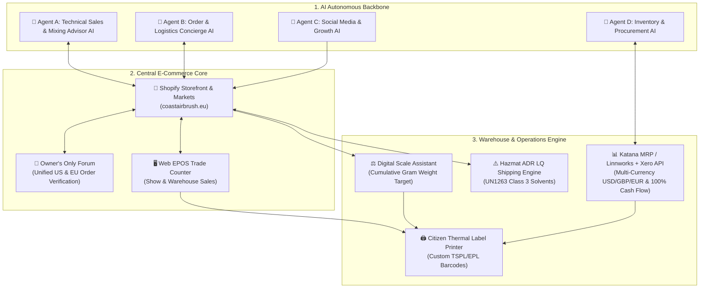
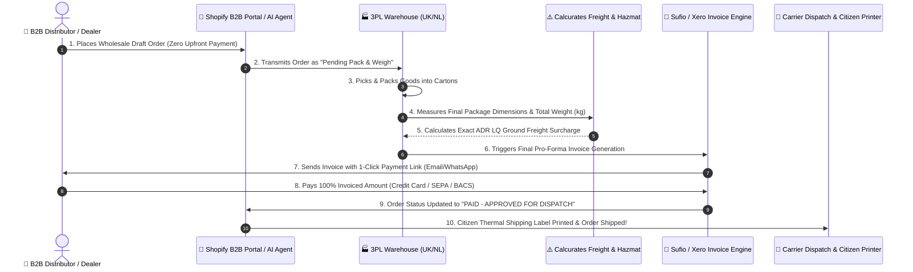
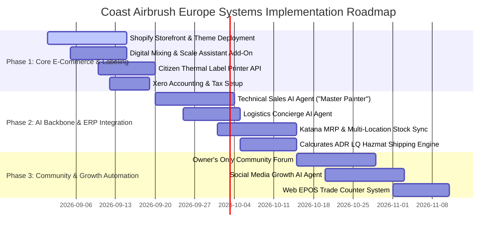

# Coast Airbrush Europe: Ultimate AI-Driven E-Commerce Ecosystem & Technical Add-On Specification

> [!IMPORTANT]
> **Executive Mandate & Vision**  
> To build an ultra-efficient, zero-friction pan-European e-commerce powerhouse for Coast Airbrush Europe that generates maximum B2C and B2B sales across the UK and 27 EU Member States with minimal staff overhead. 
> 
> **AI Autonomous Agents** will form the operational backbone of the business—selling, advising, forecasting inventory, automating social media marketing, and proactively updating customers through every stage of fulfillment.

---



---

## 1. The 4 Autonomous AI Agents (The Business Backbone)

To achieve maximum sales volume with minimal staffing, four specialized AI agents will run the daily operations of Coast Airbrush Europe:

### 🤖 Agent A: Technical Sales & Paint Advisor AI ("The Master Painter")
* **Role**: 24/7 Technical Consultant, Pre-Sales Advisor, and Custom Paint Formula Expert.
* **Capabilities**:
  - **Substrate & Technical Guidance**: Answers complex technical questions regarding metal prep, epoxy primers, flash times, reducer selections based on ambient temperature, clearcoat sanding, and pinstriping techniques.
  - **Airbrush & Equipment Matching**: Recommends exact needle sizes (0.18mm to 0.5mm), air pressure (PSI/Bar), and CFM air requirements for Anest Iwata, Paasche, and Badger spray guns based on paint viscosity.
  - **Automated Formula Cart Builder**: Generates direct one-click checkout links with pre-selected paint bases, effect pacs, reducers, and scale mixing ratios pre-configured.

### 🤖 Agent B: Autonomous Order & Logistics AI Agent ("The Order Concierge")
* **Role**: Customer Order Tracking, Customs Support, and Proactive Communication.
* **Capabilities**:
  - **Proactive Order Milestones**: Sends automated WhatsApp, SMS, and Email updates at key milestones: *Order Received $\rightarrow$ Solvent Batch Mixed $\rightarrow$ Picked & Packed $\rightarrow$ Dispatch $\rightarrow$ Customs Clearance $\rightarrow$ Out for Delivery*.
  - **Self-Service Order Inquiries**: Handles 95%+ of customer inquiries (*"Where is my order?"*, *"Can I change my delivery address?"*, *"Send me my VAT invoice"*).
  - **Customs & Duty Support**: Automatically sends Sufio EU OSS / UK PVA VAT invoices to commercial B2B jobbers.

### 🤖 Agent C: Social Media & Growth AI Agent ("The Kustom Marketer")
* **Role**: Autonomous Content Creation, Trend Tracking, and DM-to-Sale Conversion.
* **Capabilities**:
  - **Multi-Platform Posting**: Automatically curates and schedules daily high-impact video reels and shorts across Instagram, TikTok, and YouTube showcasing custom paint flips, pinstriping clips, and airbrush artwork.
  - **DM Sales Automation**: Listens to comments and direct messages (*"What color is this?"*, *"Where can I buy this kit?"*) and responds instantly with direct Shopify cart checkout links.
  - **Community Trend Scraper**: Monitors trending custom paint hashtags (`#HouseOfKolor`, `#KromaEdge`, `#AirbrushArt`) to identify viral techniques and feature customer builds.

### 🤖 Agent D: Inventory Forecasting & Procurement AI Agent ("The Stock Guru")
* **Role**: Multi-Location Inventory Synchronization, Monthly Dynamic Lean Stock Control, and Purchase Order Automation.
* **Capabilities**:
  - **Monthly Dynamic Lean Stock Optimization**: Evaluates sales velocity, supplier lead times, buffer targets, and carrying storage costs on a **month-by-month basis** to optimize inventory levels. Enforces strict Lean Stock Control to eliminate excessive stock costs and capital lockup.
  - **Predictive Restock Triggers**: Calculates sales velocity across UK and Netherlands 3PL warehouses and automatically drafts Purchase Orders (POs) to **Signal Japan** (Scenario 1 bulk ocean) or **Coast USA** (Scenario 2 air buffer).
  - **Stock Sync**: Maintains zero-over-sell real-time stock sync across Shopify, B2B wholesale portals, and EPOS trade counters.

---

## 2. Citizen Desktop Thermal Label Printer & Warehouse Barcode System

### 🖨️ Hardware & Driver Architecture
- **Target Hardware**: Citizen Thermal Transfer Printer (e.g. Citizen CL-S621 / CL-E300).
- **Print Middleware Engine**: WebUSB / QZ Tray / Browser Direct Print API that executes direct raw TSPL/EPL printer commands without dialog boxes.

### 🏷️ 3 Bespoke Barcode Label Types Printed Automatically:

```
┌──────────────────────────────────────────────────────────────────────────┐
│ COAST AIRBRUSH EUROPE - CUSTOM PAINT BATCH LABEL                         │
│ SKU: HOK-KK01-QT              ORDER #: #EU-10492                        │
│ BATCH ID: B-2026-0829         MIX RATIO: 4 : 1 : 1                      │
├──────────────────────────────────────────────────────────────────────────┤
│ COMPONENT breakdown (Cumulative Gram Scale Target):                      │
│  - S2-00 FX Karrier Base:       320.0g  (Scale Target: 320.0g)          │
│  - KK01 Kandy Koncentrate:       40.0g  (Scale Target: 360.0g)          │
│  - RU311 Medium Reducer:         80.0g  (Scale Target: 440.0g)          │
├──────────────────────────────────────────────────────────────────────────┤
│ ⚠️ UN1263 CLASS 3 FLAMMABLE LIQUID  [GHS Flame Symbol]                   │
│ ||||||||||||||||||||||||||||||||||||||||||||||||||||||||||||||||||||||| │
│ *HOK-KK01-QT-B20260829*                                                  │
└──────────────────────────────────────────────────────────────────────────┘
```

1. **Custom Paint Batch & Scale Mixing Label**:
   - Printed at the mixing bench as soon as a formula is mixed.
   - Displays exact component weights (g), cumulative scale targets, batch ID, customer order number, and GHS UN1263 Class 3 Flammable Liquid hazard symbols.
2. **Internal Stock & Receiving Barcode Label**:
   - Printed upon receiving bulk shipments from Japan/US.
   - Contains EAN-13 / Code-128 barcodes, bin location (e.g. `BIN-A12-SHELF3`), SKU, and reorder threshold.
3. **Dispatch & Package Label**:
   - Printed at the packing station for picking, packing, and carrier dispatch (ADR Limited Quantity mark for ground shipping).

---

## 3. Two-Tier Order & Payment Workflow Architecture



### 🏬 Flow A: B2C Retail E-Commerce Checkout
- **Payment Timing**: **Immediate 100% Upfront Payment** at checkout via Shopify Payments, Credit Cards, Apple Pay, or PayPal.
- **Fulfillment**: Auto-routed to 3PL warehouse for instant picking, packing, and automated shipping.

### 🏢 Flow B: B2B Distributor & Dealer Wholesale Order Workflow ("Pack, Weigh, Invoice, Pay, Ship")
1. **Order Acceptance (Zero Upfront Payment)**: Dealer places wholesale order via B2B Portal or Technical Sales AI Agent (Agent A). Order is accepted as a **"Draft Wholesale Reservation"** without requiring immediate credit card entry.
2. **Physical Packing & Scale Weighing**: 3PL warehouse picks and packs the heavy paint tins, spray guns, and ancillaries into final shipping cartons.
3. **Exact Freight & Hazmat Calculation**: Package dimensions and scale weight (kg) are transmitted to the **Calcurates Hazmat Engine**, applying exact ADR Limited Quantity ground carrier rates.
4. **Automated Pro-Forma Invoice**: **Sufio / Xero** generates the final itemized Pro-Forma Invoice (Products + Exact Packaged Freight + EU OSS / UK PVA VAT).
5. **AI Order Notification**: **Agent B (Order Concierge AI)** alerts the dealer via Email, WhatsApp, and SMS with an instant 1-click Shopify Payment Link.
6. **Payment & Warehouse Release**: Once 100% payment confirmation is received, the Citizen thermal printer prints the final shipping label, and the order is immediately dispatched!
7. **Zero Credit Risk**: Protects company cash flow (0 DSO) while ensuring dealers are billed **100% accurate, exact freight costs** on heavy custom paint shipments.

---

## 4. Shopify Native Capabilities vs. Custom Add-On Development Matrix

| Business Function | Handled by Standard Shopify | What We MUST Develop / Integrate (Add-On Ecosystem) |
| :--- | :--- | :--- |
| **Basic Checkout & Payments** | ✅ Native (Shopify Payments, Credit Cards, Apple Pay, PayPal). | Custom **100% Upfront Billing Enforcement** (blocking credit terms/30-day invoice options). |
| **Custom Paint Mixing Calculator** | ❌ Not Supported natively. | **DEVELOPED**: Custom JS Mixing Engine (`js/mixingEngine.js`) calculating mL/Fl Oz/Scale Grams & line-item properties. |
| **Digital Scale Assistant** | ❌ Not Supported natively. | **DEVELOPED**: Cumulative weight calculation UI & scale calibration modal integrated into Shopify Cart. |
| **Citizen Thermal Label Driver** | ❌ Basic browser print dialogs only. | **TO DEVELOP**: Direct Browser-to-Citizen TSPL/EPL raw thermal print driver API for stock & mixed paint labels. |
| **Pan-European Tax & Duty** | ⚠️ Partial (Basic tax rules). | **INTEGRATED**: Sufio EU OSS & UK PVA Tax Engine + Calcurates Hazmat Freight Engine. |
| **Owner's Only Community Forum** | ❌ Not Supported natively. | **TO DEVELOP**: Web-based Community Forum integrated with Shopify Order API (verifies US & EU buyer order IDs). |
| **EPOS Trade Counter** | ⚠️ Basic Shopify POS app. | **CUSTOMIZED**: Customized Web EPOS for trade counters & trade shows connected to Citizen printer & scale. |
| **ERP & Accounting System** | ❌ Requires 3rd Party API. | **INTEGRATED**: Katana MRP / Linnworks + Xero API for multi-currency (USD/GBP/EUR) & landed cost accounting. |
| **Social Media AI Marketing** | ❌ Manual posting only. | **TO DEVELOP**: Autonomous Social Media AI Agent for Instagram/TikTok/YouTube content & DM sales bot. |

---

## 4. Detailed Specification of Custom Add-Ons To Develop

### 🛠️ Add-On 1: Citizen Label Print Engine & Barcode Middleware
- **Purpose**: Automates all physical warehouse labeling for stock control, mixed paint batches, and dispatch packing.
- **Features**:
  - One-click printing from Shopify Admin, Custom Mixing Calculator, or EPOS terminal.
  - Generates Code-128 and QR barcodes containing SKU, Order ID, and Batch Number.
  - Automatically includes GHS Hazard Symbols (UN1263 Class 3 Flammable Liquid) for solvent paints.

### 💬 Add-On 2: "Owner's Only" Community Forum (US & Europe Order Sync)
- **Purpose**: Builds an exclusive community for custom painters, airbrush artists, and B2B body shops while driving repeat sales.
- **Features**:
  - **Shopify Order Verification**: Users enter their Shopify Order ID or equipment serial number (from US or Europe store) to unlock a **"Verified Builder"** badge.
  - **Formula & Recipe Sharing**: Members can publish custom paint mix recipes (e.g. *"Candy Apple Red over Metallic Gold Base"*), which automatically generate one-click purchase links for the exact paints required!
  - **Cross-Border Hub**: Connects UK, European, and US painters in one centralized knowledge base.

### 🖥️ Add-On 3: Pan-European B2B & B2C Web EPOS Front-End
- **Purpose**: Enables rapid counter sales at warehouse pickup locations and live pop-up trade show booths (e.g. Essen Motor Show, Automechanika Frankfurt).
- **Features**:
  - Touchscreen UI optimized for iPad/tablet or desktop.
  - Integrated barcode scanner support.
  - Live connection to Citizen thermal printer for instant receipts and package labels.
  - Real-time stock deduction from Shopify inventory pool.

### ⚠️ Add-On 4: Calcurates Dangerous Goods / ADR LQ Shipping Engine
- **Purpose**: Ensures 100% legal compliance and lowest shipping costs for UN1263 Class 3 Flammable Liquids across the UK and 27 EU Member States.
- **Features**:
  - Automatically calculates container liquid volumes (\(\le 5\text{L}\)) and outer carton weights (\(\le 30\text{kg}\)).
  - Applies **ADR Limited Quantity (LQ) ground exemptions**, reducing package freight surcharges from €75 (air hazmat) down to €6–€12 (ground ADR LQ).
  - Automatically splits orders containing hazardous solvents vs non-hazardous airbrushes/brushes into optimal shipping packages.

### 📊 Add-On 5: ERP & Accounting Integration (Xero + Katana MRP)
- **Purpose**: Automated financial tracking, multi-currency management, and landed cost accounting.
- **Features**:
  - **100% Upfront Cash Collection**: Zero DSO, zero credit risk.
  - **Multi-Currency Sync**: Invoices in USD (supplier), GBP (UK sales), and EUR (EU sales) seamlessly reconciled in Xero.
  - **Automated Landed Cost Math**: Factors FOB cost, freight, brokerage, and 6.5% customs duty into exact inventory valuation.

---

## 5. Complete Product Scope & Compliance Rules

The ecosystem is built to handle the full Coast Airbrush product catalog:

1. **Solvent-Based Paints (House of Kolor, Ace of Shades, Kroma Edge)**:
   - Classification: UN1263 Class 3 Flammable Liquids, Packing Group II/III.
   - Compliance: ADR Limited Quantity ground shipping across EU/UK.
2. **Water-Based Acrylic Paints (Createx, Wicked Colors)**:
   - Classification: Non-Hazardous. Standard parcel shipping.
3. **Airbrushes & Spray Guns (Anest Iwata, Paasche, Badger, Kroma)**:
   - Classification: Precision Hardware (HS Code 8424.20.00). 0% duty from Japan (REX).
4. **Flake King Complete Product Range**:
   - Dry Flake Guns (Flake King 1000/2000), complete range of Metal Flakes (Standard, Micro, Mini, Holographic, Laser Flake), dry flake jar systems, and application kits.
5. **Specialist Masking Tapes**:
   - High-tack & fine-line masking tapes (1/16", 1/8", 1/4", 1/2", vinyl fine-line, crepe tape, paper masking, precision curve tapes).
6. **Pinstriping Brushes**:
   - Mack Brushes, Handiedan, Ace of Shades, pinstriping quills, mops, scroll brushes, sizing brushes, and brush care oils.
7. **Stencils & Airbrush Shields**:
   - Airbrush stencils, laser-cut custom graphic stencils, skull/flame/texture shields, and adhesive masking films.
8. **VsionAir Products & Workstation Rigs**:
   - VsionAir workstation rigs, airbrush holding systems, spinning turntables, magnetic mounting bases, and spray booth accessories.
9. **Engine Tool Turners & Metalworking Accessories**:
   - Engine turning / jeweling tools, abrasive turning pegs, rose engine turning mandrels, and custom metal finishing accessories.

---

## 6. Phased Implementation Roadmap



---

This blueprint details every technical add-on, AI agent capability, hardware driver integration, and ERP accounting rule required to build your ultimate autonomous sales machine!
